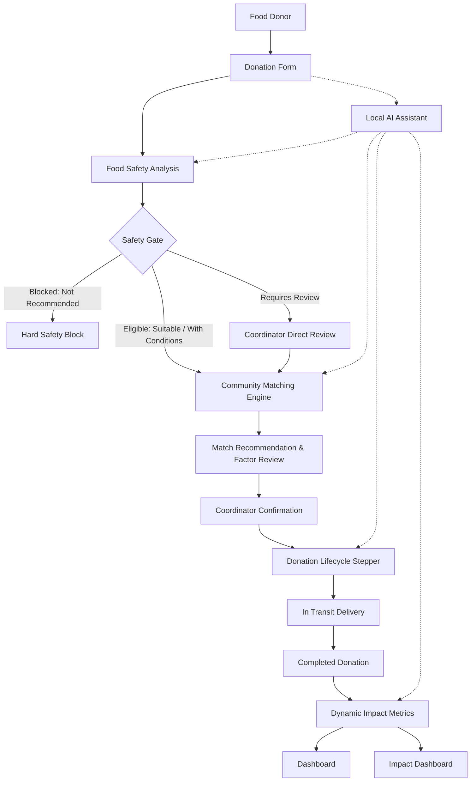
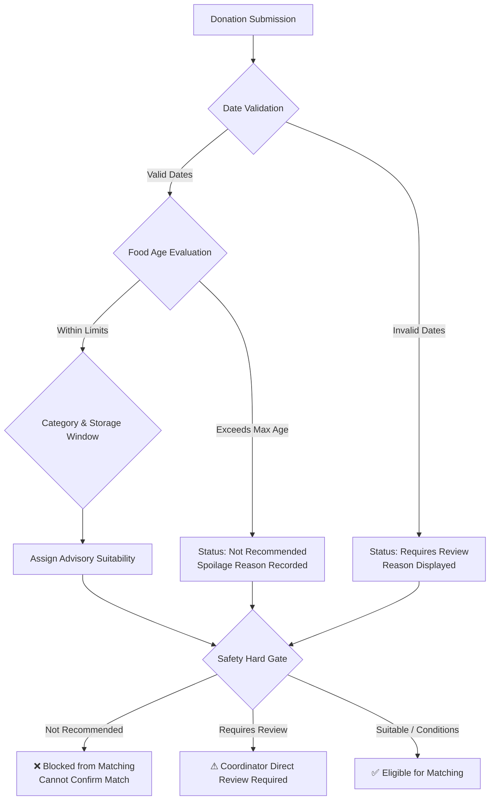
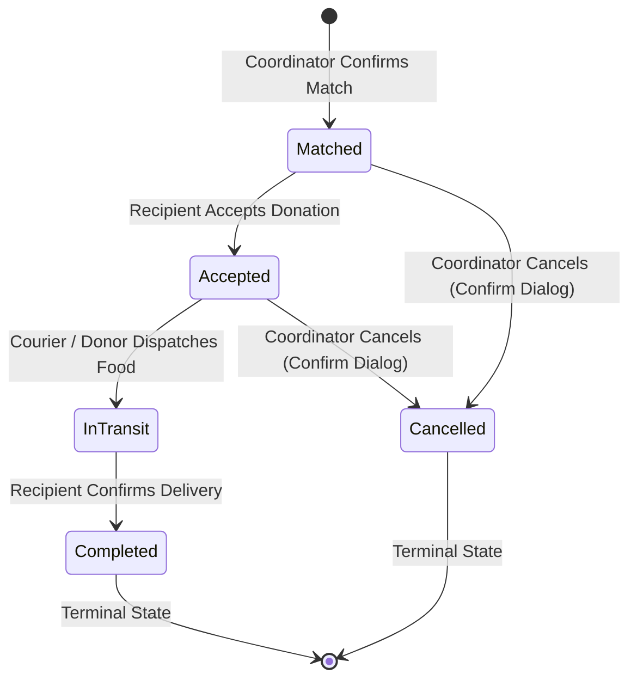
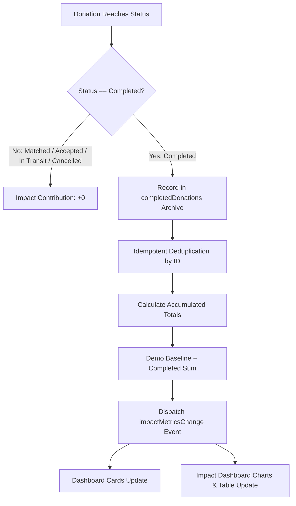

# FoodBridge AI

> **AI-Assisted Food Rescue & Community Redistribution Platform**

FoodBridge AI is an intelligent sustainability platform designed to help community coordinators and food donors assess surplus food, determine redistribution suitability, and connect edible surplus with local organisations in need. Built on a safety-first architecture, FoodBridge AI keeps human decision-makers in complete control at every stage while automating shelf-life evaluation, priority scoring, multi-factor community matching, and lifecycle tracking.

> [!NOTE]
> **Demonstration Platform**: FoodBridge AI is a fully functional web demonstration. Community recipient profiles, baseline figures, and matching recommendations are simulated using deterministic, local logic to showcase the end-to-end redistribution workflow without requiring external APIs or live food bank integrations.

---

## Architecture



---

## Problem Statement

Every year, millions of tonnes of wholesome, edible surplus food are discarded by bakeries, commercial kitchens, grocery markets, and event organisers. At the same time, community organisations and relief shelters face ongoing food insecurity.

Key challenges in surplus food redistribution include:
1. **Time-Critical Expiry**: Surplus food deteriorates rapidly; donors often lack the time to assess shelf life and find suitable recipients manually.
2. **Food Safety Risks**: Incorrect temperature management, storage conditions, or elapsed consumption windows create health hazards.
3. **Logistics & Alignment**: Mismatches between donated quantities, food categories, and recipient storage capacities lead to wasted coordination efforts.
4. **Lack of Transparency**: Coordinators need clear, plain-language reasoning for recommendations rather than opaque "black-box" decisions.

---

## Solution

FoodBridge AI provides an automated, human-supervised redistribution pipeline:

```
Donor enters surplus details
  ↳ Deterministic Food Safety Analysis
    ↳ Safety Hard Gate (Eligible vs. Blocked)
      ↳ Multi-Factor Community Matching
        ↳ Coordinator Review & Match Confirmation
          ↳ Linear Donation Lifecycle (Matched → Accepted → In Transit → Completed)
            ↳ Session-Persisted Dynamic Impact Metrics
```

---

## Key Features

1. **Surplus Food Submission**: Streamlined donation intake capturing food name, category, quantity, unit, preparation timestamp, availability deadline, storage conditions, location area, and dietary/allergen notes.
2. **Deterministic Food Safety Analysis**: Instant advisory evaluation calculating food age, remaining consumption windows, storage guidance, safety considerations, and advisory suitability tiers.
3. **Safety Hard Gate**: Architectural prevention mechanism that blocks `Not Recommended` food from reaching community matching or match confirmation.
4. **Community Matching Engine**: Multi-factor scoring engine evaluating recipient category compatibility, quantity alignment, availability status, geographic proximity, and urgency.
5. **Transparent Match Factors**: Plain-language explanations and structured visual factor chips (`Category`, `Quantity`, `Available`, `Location`, `Safety`) showing why each match scored as it did.
6. **Donation Lifecycle Tracking**: Sequential state stepper tracking confirmed donations through `Matched` &rarr; `Accepted` &rarr; `In Transit` &rarr; `Completed`.
7. **Safe Cancellation Handling**: Protected cancellation workflow permitted only from non-terminal states (`Matched` or `Accepted`) with mandatory confirmation modals.
8. **Dynamic Impact Metrics**: Reactive metrics engine that automatically accumulates completed donations into platform totals across both the home Dashboard and Impact Dashboard.
9. **Recent Completed Donations**: Completed donations dynamically appear at the top of the Recent Donations table with active status badges.
10. **Conversational AI Assistant**: Local, deterministic conversational assistant supporting natural-language questions about food safety, donation procedures, lifecycle stages, and sustainability.
11. **Session Persistence**: Complete persistence of active form progress, safety assessments, donation lifecycles, and accumulated metrics across SPA route changes and browser refreshes (`sessionStorage`).
12. **Responsible AI & Human Oversight**: Advisory notices, clear disclaimer headers, and explicit coordinator review gates ensuring AI supports decisions without replacing human authority.

---

## AI & Intelligent Components

### 1. Food Safety Analysis
The food safety analysis service (`src/services/mockAnalyzer.ts` via `src/services/aiService.ts`) runs local, deterministic evaluation algorithms:
- **Timestamp Relationship Validation**: Checks for chronological consistency (flags preparation dates in the future or availability deadlines earlier than preparation).
- **Food Age Calculation**: Compares preparation date against the current time. Food stored beyond category thresholds (e.g. prepared meals > 24 hours, bakery items > 72 hours) is classified as stale or spoiled.
- **Suitability Classification**: Produces one of four advisory classifications:
  - `Suitable`: Fresh food within normal redistribution limits.
  - `Suitable with Conditions`: Usable food requiring immediate handover or cold-chain verification.
  - `Requires Review`: Food with borderline parameters or missing fields requiring physical assessment.
  - `Not Recommended`: Expired, spoiled, or improperly stored food.

### 2. Community Matching Engine
The matching engine (`src/services/matchingService.ts`) evaluates candidate community requests across five weighted criteria alongside a safety prerequisite, producing an explainable 0–100 compatibility score.

### 3. Local Conversational Assistant
The assistant (`src/services/assistantService.ts`) provides intent-driven natural language support:
- **Local & Deterministic**: Zero network requests, zero external LLM dependencies, zero API keys.
- **Session-Aware Context**: Inspects current `sessionStorage` state to reference active food names, safety classifications, or current donation steps when answering user questions.
- **Strict Guardrails**: Never fabricates safety certifications and gracefully handles unknown topics by providing suggested platform prompts.

---

## Safety Architecture



> [!CAUTION]
> **Advisory Notice**: FoodBridge AI recommendations are decision-support outputs. The platform never claims food is "100% safe", "guaranteed safe", or "definitely safe". Physical inspection and temperature verification by a designated human coordinator are mandatory before food handover.

---

## Multi-Factor Matching Criteria

The matching engine ranks recipient organizations based on five transparent, weighted factors:

| Criterion | Max Weight | Evaluation Logic | Rationale |
| :--- | :---: | :--- | :--- |
| **Category Compatibility** | **35 pts** | Exact match with recipient's requested food categories (`35 pts`); partial overlap (`20 pts`); mismatched (`0 pts`). | Ensures organizations receive food suitable for their serving facilities and dietary policies. |
| **Quantity Alignment** | **25 pts** | Available servings meet recipient stated need (`25 pts`); partial need &ge; 50% (`15 pts`); minimal need &lt; 50% (`5 pts`). | Minimizes logistical overhead by matching bulk surplus with high-capacity recipients. |
| **Availability Match** | **15 pts** | Recipient is actively `Open` (`15 pts`); `Partially Matched` (`10 pts`); `Closed` (`0 pts` / excluded). | Prevents dispatching donations to organizations that cannot receive them. |
| **Location Proximity** | **15 pts** | Same district/neighborhood (`15 pts`); adjacent district (`10 pts`); distant (`5 pts`). | Minimizes transit time to maintain food temperature integrity and reduce transport emissions. |
| **Urgency Level** | **10 pts** | Recipient request flagged `Critical` (`10 pts`); `High` (`8 pts`); `Medium` (`5 pts`); `Low` (`2 pts`). | Directs time-sensitive surplus to shelters with immediate meal gaps. |
| **Safety Hard Gate** | **Prerequisite** | Rejects unviable or `Not Recommended` food prior to score calculation. | Hard architectural block preventing unsafe food from reaching community recipients. |

---

## Donation Lifecycle



- **Transition Rules**: State transitions follow a strict linear progression. Backwards transitions are blocked to ensure coordination integrity.
- **Terminal States**: `Completed` and `Cancelled` donations cannot be re-opened.
- **Session Reset**: Clicking "Start a New Donation" clears only the active donation stepper, allowing new donations while preserving accumulated historical impact.

---

## Dynamic Impact Metrics



### Metrics Table

| Metric | Demonstration Baseline | Incremental Contribution (Completed) | Intermediate / Cancelled State |
| :--- | :--- | :--- | :--- |
| **Meals Potentially Supported** | `1,240` | `+ donation.estimatedServings` | `+ 0` |
| **Food Potentially Redirected** | `312 kg` | `+ parseKgFromDonation(quantity, servings)` | `+ 0` |
| **Donation Events** | `47` | `+ 1` per completed donation | `+ 0` |
| **Successful Matches** | `29` | `+ 1` per completed donation | `+ 0` |
| **Community Requests** | `38` | `Math.max(38, successfulMatches)` | `+ 0` |
| **Match Success Rate** | `76%` (29/38) | `Math.round((matches / requests) * 100)` | Unchanged (`76%`) |

*All baseline figures represent simulated demonstration data.*

---

## UN Sustainable Development Goals (SDG) Alignment

FoodBridge AI is designed to support sustainable food systems through verified, conservative impact pathways:

### Primary Focus: SDG 12 — Responsible Consumption and Production
* **Target 12.3: Halving Global Food Waste by 2030**: FoodBridge AI enables commercial kitchens, bakeries, and markets to rescue edible surplus food before expiration. By automating food safety triage and logistics matching, the platform helps prevent edible surplus from entering municipal waste streams.

### Secondary Focus: SDG 2 — Zero Hunger
* **Target 2.1: Access to Safe, Nutritious Food**: Connecting surplus food with vetted community shelters, food pantries, and youth centers supports local nutritional resilience, helping bridge hunger gaps in vulnerable communities.

### Supporting Focus: SDG 13 — Climate Action
* **Target 13.3: Climate Change Mitigation & Methane Abatement**: Organic waste decomposing in anaerobic municipal landfills is one of the largest sources of anthropogenic methane ($\text{CH}_4$), a potent greenhouse gas. Redirecting surplus food to human consumption avoids landfill decomposition and its associated carbon footprint.

### Supporting Focus: SDG 3 — Good Health and Well-Being
* **Target 3.9: Foodborne Illness Prevention**: Through strict algorithmic food safety classification, cold-chain checks, and a hard safety gate, FoodBridge AI prevents spoiled or temperature-compromised food from reaching vulnerable populations.

---

## Responsible AI & Ethics

* **Human-in-the-Loop**: All AI outputs (shelf life, match scores, priority rankings) are advisory. Redistribution requires explicit human confirmation.
* **Algorithmic Transparency**: Every match displays its underlying factor breakdown (`Category`, `Quantity`, `Availability`, `Location`, `Safety`), eliminating "black box" decisions.
* **Privacy by Design**: Collects zero personal phone numbers, emails, or personal identification. Donations require only food attributes and general district locations.
* **Predictable & Verifiable**: Fully deterministic algorithms eliminate model hallucinations, latency spikes, and stochastic variations.

---

## Technology Stack

* **Frontend Framework**: React 18.2 with TypeScript 5.2
* **Build Tool & Bundler**: Vite 5.0
* **Routing**: React Router DOM v6
* **Styling**: CSS Modules with a custom CSS Custom Properties design system
* **Persistence**: Browser `sessionStorage` with custom event dispatching
* **Package Manager**: npm

---

## Project Structure

```
foodbridge-ai/
├── public/
│   └── favicon.svg              # Application branding icon
├── src/
│   ├── components/
│   │   ├── common/              # MetricCard, PageHeader, StatusBadge
│   │   └── layout/              # Header navigation, Layout shell, Footer
│   ├── data/
│   │   └── demoData.ts          # Baseline simulated community requests & demo entries
│   ├── pages/
│   │   ├── Dashboard.tsx        # Overview, hero, platform metrics, principles
│   │   ├── DonateFoodPage.tsx   # Surplus food intake form with client validation
│   │   ├── FoodAnalysisPage.tsx # Advisory food safety evaluation view
│   │   ├── CommunityMatchingPage.tsx # Multi-factor match recommendations & confirmation
│   │   ├── DonationStatusPage.tsx    # Sequential lifecycle stepper with demo controls
│   │   ├── ImpactDashboardPage.tsx   # Impact metrics, bar charts, and recent donations
│   │   └── AIAssistantPage.tsx       # Local conversational assistant chat interface
│   ├── services/
│   │   ├── aiService.ts         # Public facade for food safety analysis
│   │   ├── mockAnalyzer.ts      # Deterministic food safety engine & age evaluator
│   │   ├── matchingService.ts   # Multi-factor community matching algorithms
│   │   ├── donationStore.ts     # State management, completed archives, and metrics aggregator
│   │   ├── assistantService.ts  # Intent detection & context-aware assistant engine
│   │   └── ragService.ts        # Reference stub for domain knowledge expansion
│   ├── styles/
│   │   └── global.css           # Design tokens, typography, grid layouts, responsive breakpoints
│   ├── types/
│   │   └── index.ts             # Strict TypeScript definitions across domain models
│   ├── App.tsx                  # Client route definitions
│   └── main.tsx                 # React DOM entry point
├── knowledge-base/
│   └── README.md                # Domain standards documentation
├── docs/
│   ├── FoodBridge_AI_Final_Report.md # Comprehensive engineering & academic report
│   ├── PROJECT_SUMMARY.md       # Concise presentation overview
│   ├── TEST_REPORT.md           # Formal testing & verification results
│   └── DIAGRAMS.md              # Standalone Mermaid system diagrams
├── package.json                 # Project dependencies and npm scripts
├── tsconfig.json                # TypeScript compiler configuration
└── vite.config.ts               # Vite configuration
```

---

## Local Setup

### Prerequisites
- Node.js (v18.0.0 or higher recommended)
- npm (v9.0.0 or higher)

### Installation
```bash
# Clone the repository
git clone https://github.com/your-username/foodbridge-ai.git

# Navigate into project directory
cd foodbridge-ai

# Install dependencies
npm install

# Start local development server
npm run dev
```

The Vite dev server will start and provide a local URL (typically `http://localhost:5173`).

### Production Build
```bash
npm run build
```
Compiles TypeScript and bundles production-optimised assets into the `dist/` directory.

---

## Testing & Verification

The platform has been audited using automated unit tests, lifecycle scripts, and headless browser tests via Chrome DevTools Protocol (CDP):

| Audit Category | Test Script / Command | Verified Status |
| :--- | :--- | :--- |
| **Production Build** | `npm run build` | **PASS** (0 TypeScript errors, 1.30s build) |
| **Food Safety Hard Gate** | `test_suite.ts` | **PASS** (10-day bread & spoiled food blocked) |
| **Matching Engine** | `test_suite.ts` | **PASS** (Ranked by factors; closed requests excluded) |
| **Lifecycle Stepper** | `test_suite.ts` | **PASS** (Valid transitions enforced; terminal guards active) |
| **Dynamic Metrics** | `test_metrics.ts` | **PASS** (10/10 lifecycle cases passed; idempotent) |
| **AI Assistant** | `test_assistant.ts` | **PASS** (30/30 natural language intents verified) |
| **Browser E2E Lifecycle** | `test_browser_metrics_cdp.ts` | **PASS** (Full multi-donation browser flow verified) |
| **Browser Console** | Headless Chrome/Edge audit | **0 console errors** |

---

## Demonstration Flow

1. **Platform Overview**: Open the Dashboard (`/`) to review design principles and baseline platform metrics (`1,240` meals, `312 kg`, `47` donation events).
2. **Submit Surplus Food**: Click **Donate Surplus Food** (`/donate`). Enter food details (e.g. `Vegetable Curry & Rice`, `Prepared Meals`, `25 portions`, cooked today).
3. **Food Safety Analysis**: Click **Analyse Surplus Food**. The advisory engine assesses remaining shelf life, storage requirements, and assigns suitability (`Suitable with Conditions`).
4. **Community Matching**: Click **Find Community Matches** (`/matching`). Review ranked community organisations with match scores and transparent factor breakdowns.
5. **Confirm Match**: Select a matching organisation (e.g. `Community Center A`) and click **Confirm Match**.
6. **Track Lifecycle**: On **Donation Status** (`/donation-status`), advance the donation sequentially: `Matched` &rarr; `Accepted` &rarr; `In Transit` &rarr; `Completed`.
7. **Observe Dynamic Metrics**: Navigate back to **Dashboard** or **Impact** (`/impact`). Observe that platform metrics have updated dynamically (`1,265` meals, `322 kg`, `48` donation events, `79%` match rate), and the completed donation appears in the Recent Donations table.
8. **Consult AI Assistant**: Open **AI Assistant** (`/assistant`). Ask about food safety guidelines, donation status, or sustainability to observe context-aware responses.

---

## Limitations

1. **Demonstration Scope**: The application is an educational and technical demonstration. Community partners, requests, and baseline metrics are simulated.
2. **Session Storage**: State is persisted in browser `sessionStorage`. Opening a new private tab or clearing browser data resets state to baseline figures.
3. **Deterministic Logic**: Food safety analysis and matching utilise deterministic rule engines rather than external cloud AI endpoints to guarantee privacy, reliability, and zero-token operation.
4. **Advisory Decisions**: Food safety assessments are decision-support outputs; physical inspection by food coordinators remains essential before redistribution.

---

## Screenshots

> *Screenshots may be placed in a `docs/screenshots/` folder for presentations or portfolio display.*

1. **Dashboard & Overview** — `docs/screenshots/01_dashboard.png`
2. **Donation Intake Form** — `docs/screenshots/02_donation_form.png`
3. **Advisory Food Safety Assessment** — `docs/screenshots/03_food_analysis.png`
4. **Transparent Community Matching** — `docs/screenshots/04_community_matching.png`
5. **Donation Lifecycle Stepper** — `docs/screenshots/05_donation_status.png`
6. **Dynamic Impact Dashboard** — `docs/screenshots/06_impact_dashboard.png`
7. **Conversational AI Assistant** — `docs/screenshots/07_ai_assistant.png`

---

## Future Scope & Roadmap

While FoodBridge AI currently operates as a self-contained, deterministic client application, planned production expansions include:

1. **Multi-Tenant Coordinator Authentication**: Role-based access control (RBAC) for certified food donors, verified recipient coordinators, and volunteer couriers.
2. **Cold-Chain IoT Telemetry**: Direct sensor integration with low-cost Bluetooth/NFC data loggers to continuously verify temperature-controlled transit.
3. **Dynamic Routing & Geolocation**: Integration with open-source GIS routing (e.g. OSRM) for multi-stop food pickup and drop-off route optimisation.
4. **Decentralised Impact Auditing**: Verifiable cryptographic logging of completed donation weights for ESG corporate sustainability reporting.
5. **Progressive Web App (PWA) Offline Sync**: Offline-first capability with service workers enabling volunteer dispatchers to log deliveries in areas with weak cellular reception.

---

## Academic & Project Context

Developed as part of the **1M1B (1 Million Leaders Insights to Action) AI for Sustainability** initiative, FoodBridge AI demonstrates how ethical, responsible AI architectures can address critical real-world challenges aligned with:
- **UN SDG 12 (Responsible Consumption and Production)**: Target 12.3 (food waste reduction)
- **UN SDG 2 (Zero Hunger)**: Target 2.1 (access to safe food)
- **UN SDG 13 (Climate Action)**: Target 13.3 (landfill methane abatement)
- **UN SDG 3 (Good Health and Well-Being)**: Target 3.9 (food safety and illness prevention)

By combining algorithmic transparency, strict food-safety gates, human-in-the-loop oversight, and local deterministic processing, FoodBridge AI demonstrates that impactful technology does not require opaque cloud models or risky automation—practical sustainability begins with safe, transparent, human-centered decision support.

---

## License

This project is open-source and available under the [MIT License](LICENSE).
