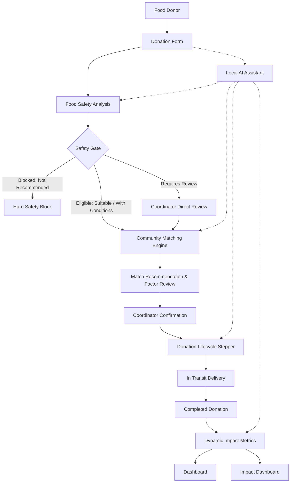
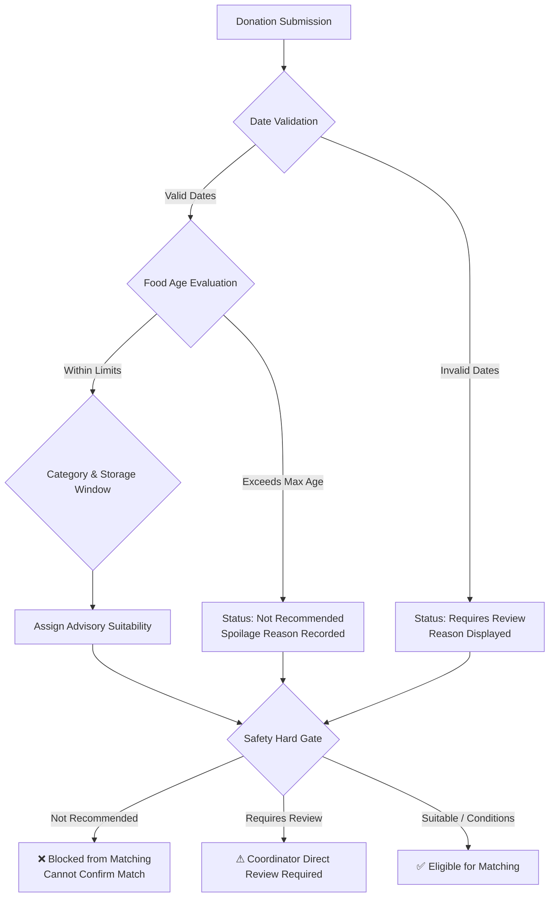
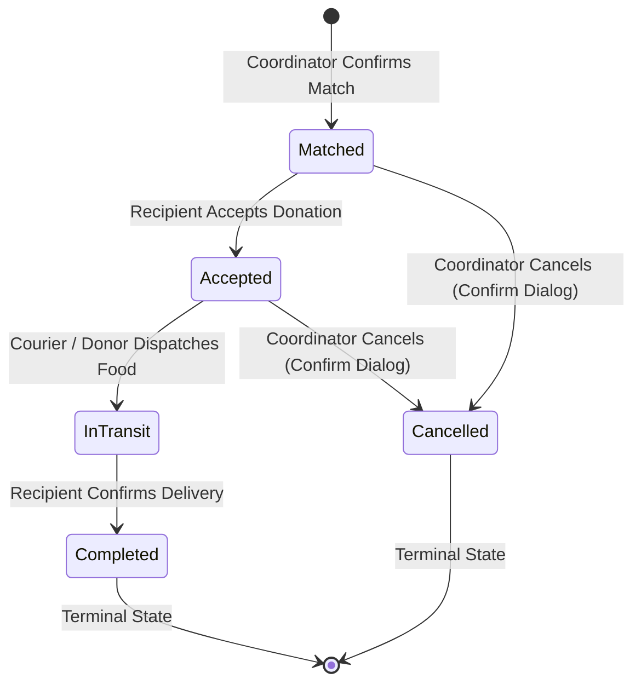
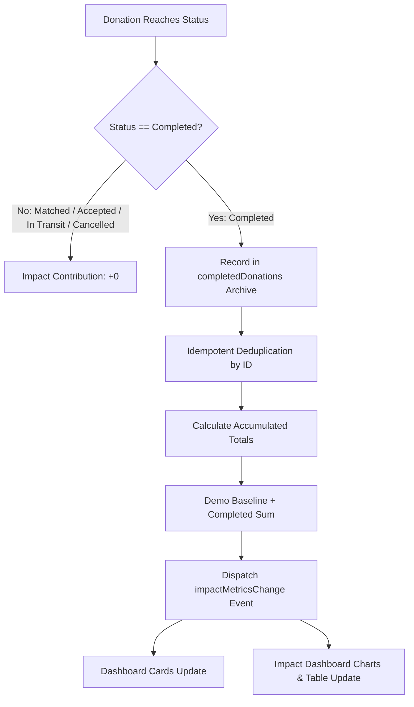

# FoodBridge AI

> **AI-Assisted Food Rescue & Community Redistribution Platform**

FoodBridge AI is an intelligent sustainability platform designed to assist community coordinators and food donors in evaluating surplus food, assessing redistribution suitability, and connecting wholesome surplus with local relief organisations in need. Built on a safety-first architecture, FoodBridge AI keeps human decision-makers in control at every stage while automating shelf-life evaluation, priority scoring, multi-factor community matching, and donation lifecycle tracking.

> [!NOTE]
> **Demonstration Platform**: FoodBridge AI is a fully functional web demonstration. Community recipient profiles, baseline metrics, and matching recommendations are simulated using deterministic, explainable local logic to showcase the end-to-end redistribution workflow without requiring external APIs or live food bank integrations.

---

## Documentation Index

| Document | Purpose & Scope |
| :--- | :--- |
| **[Comprehensive Project Report](docs/FoodBridge_AI_Final_Report.md)** | Full academic and engineering report covering problem definition, architecture, algorithms, and SDG alignment |
| **[Executive Presentation Summary](docs/PROJECT_SUMMARY.md)** | High-level presentation summary of core capabilities, architecture, and sustainability impact |
| **[System Architecture & Diagrams](docs/DIAGRAMS.md)** | 10 standalone Mermaid diagrams covering system flow, safety gate, matching, lifecycle, and metrics |
| **[Formal Test Report](docs/TEST_REPORT.md)** | Complete verification matrix, test suites, CDP browser verification, and results |
| **[Domain Knowledge Base](knowledge-base/README.md)** | Food safety guidelines, cold-chain standards, and redistribution reference thresholds |

---

## Architecture



---

## Problem Statement

Every year, millions of tonnes of wholesome, edible food are discarded by commercial kitchens, bakeries, grocery retailers, and catering events. Concurrently, community food pantries, emergency shelters, and relief organisations face ongoing food supply gaps.

Key challenges in surplus food redistribution include:
1. **Time-Critical Expiry**: Surplus food deteriorates rapidly; donors often lack the time to assess shelf-life and identify suitable recipients manually.
2. **Food Safety Risks**: Incorrect temperature handling, improper storage, or elapsed consumption windows create health hazards for vulnerable recipients.
3. **Logistics & Alignment**: Mismatches between donated quantities, food categories, and recipient storage capacities lead to wasted coordination efforts.
4. **Lack of Transparency**: Coordinators need clear, plain-language reasoning for recommendations rather than opaque "black-box" algorithmic scores.

---

## Why This Problem Matters

Food waste is both a severe humanitarian failure and an environmental crisis:
- **Humanitarian Impact**: While edible food is discarded daily, vulnerable community members experience acute food insecurity.
- **Methane Emissions**: Organic food waste deposited in municipal landfills decomposes anaerobically, generating methane ($\text{CH}_4$)—a greenhouse gas with a global warming potential significantly greater than carbon dioxide over a 20-year horizon.
- **Resource Depletion**: Wasted food squanders the embedded water, energy, agricultural land, and labor required to produce, process, and transport it.

---

## Proposed Solution

FoodBridge AI provides an automated, human-supervised redistribution pipeline that eliminates coordination friction while upholding strict food-safety protocols:

```
Donor enters surplus details
  ↳ Deterministic Food Safety Analysis
    ↳ Safety Hard Gate (Eligible vs. Blocked)
      ↳ Explainable Multi-Factor Community Matching
        ↳ Coordinator Review & Match Confirmation
          ↳ Linear Donation Lifecycle (Matched → Accepted → In Transit → Completed)
            ↳ Session-Persisted Dynamic Impact Metrics
```

---

## Key Features

1. **Surplus Food Intake**: Structured submission capturing food name, category, quantity, unit, estimated servings, preparation timestamp, availability deadline, storage conditions, location area, and dietary/allergen notes.
2. **Deterministic Food Safety Analysis**: Instant advisory evaluation calculating food age in hours, remaining shelf-life windows, storage guidance, safety considerations, and suitability tiers.
3. **Safety Hard Gate**: Architectural safety mechanism that blocks `Not Recommended` food from reaching community matching or match confirmation.
4. **Explainable Community Matching**: Multi-factor scoring engine evaluating candidate recipients on category compatibility, quantity alignment, availability status, geographic proximity, and request urgency.
5. **Transparent Match Factors**: Plain-language explanations and structured visual factor chips (`Category`, `Quantity`, `Available`, `Location`, `Safety`) explaining why each match scored as it did.
6. **Donation Lifecycle Tracking**: Sequential state stepper tracking confirmed donations through `Matched` &rarr; `Accepted` &rarr; `In Transit` &rarr; `Completed`.
7. **Protected Cancellation**: Safe cancellation workflow permitted only from non-terminal states (`Matched` or `Accepted`) with mandatory confirmation dialogs.
8. **Dynamic Impact Metrics**: Reactive metrics engine that automatically accumulates completed donations into platform totals across both the home Dashboard and Impact Dashboard.
9. **Recent Completed Donations**: Completed donations dynamically appear at the top of the Recent Donations table with active status badges.
10. **Conversational AI Assistant**: Local, deterministic conversational assistant supporting natural-language questions about food safety, donation procedures, lifecycle stages, and sustainability.
11. **Session Persistence**: Complete persistence of active form progress, safety assessments, donation lifecycles, and accumulated metrics across SPA route changes and browser refreshes (`sessionStorage`).
12. **Responsible AI & Human Oversight**: Advisory notices, clear disclaimer headers, and explicit coordinator review gates ensuring AI supports decisions without replacing human authority.

---

## How AI & Intelligent Logic Is Used

FoodBridge AI incorporates intelligence across four core modules:

### A. Food Safety Intelligence
The food safety analysis service (`src/services/mockAnalyzer.ts` via `src/services/aiService.ts`) runs local, deterministic evaluation algorithms:
- **Timestamp Validation**: Validates chronological consistency (flags preparation dates in the future or availability deadlines earlier than preparation).
- **Food Age Calculation**: Compares preparation date against the current time. Food stored beyond category thresholds (e.g. prepared meals > 24 hours, bakery items > 168 hours) is classified as stale or spoiled.
- **Suitability Classification**: Assigns one of four advisory classifications:
  - `Suitable`: Fresh food within normal redistribution limits.
  - `Suitable with Conditions`: Usable food requiring immediate handover or cold-chain verification.
  - `Requires Review`: Food with borderline parameters or missing fields requiring physical assessment.
  - `Not Recommended`: Expired, spoiled, or improperly stored food.

### B. Community Matching Intelligence
The matching engine (`src/services/matchingService.ts`) evaluates candidate community requests across five weighted criteria alongside a safety prerequisite:
- Category Compatibility (**25 pts**)
- Quantity Alignment (**20 pts**)
- Recipient Availability (**20 pts**)
- Location Proximity (**20 pts**)
- Request Urgency (**15 pts**)
- Generates transparent, human-readable match explanations and structured factor chips.

### C. Conversational Assistant
The assistant (`src/services/assistantService.ts`) provides natural-language guidance:
- **Pattern-Based Intent Detection**: Identifies 15 distinct user intents covering safety, procedures, storage, cancellation, and sustainability.
- **Session-Aware Context**: Inspects active `sessionStorage` state to reference specific submitted food items, safety classifications, or current donation stages.
- **Zero External APIs**: Operates locally with zero latency, zero token costs, and no external API keys.

### D. Safety Governance
- Enforces an automated **Safety Hard Gate** that prevents unviable food from entering the matching pipeline.
- Requires explicit coordinator authorization before any food transfer occurs.

---

## What Is Actually AI vs. Deterministic Logic

To maintain academic and technical integrity, FoodBridge AI is explicit about its implementation:

> [!IMPORTANT]
> **FoodBridge AI uses deterministic, explainable AI-assisted decision logic in the current implementation. It does not depend on a live external LLM.**
>
> - **Current Implementation**: The application is powered by deterministic heuristics, mathematical scoring models, rule-based expert safety algorithms, and pattern-based natural language intent classification.
> - **Zero External AI Services**: No cloud models (such as OpenAI, Google Gemini, Anthropic Claude, or IBM Watson), RAG vector databases, deep learning networks, or computer vision APIs are actively invoked.
> - **Advantages of this Architecture**: Fully reproducible results, zero operational token costs, zero latency spikes, complete offline capability, zero risk of hallucinated safety certifications, and total privacy for sensitive community data.

---

## Food Safety Decision Architecture



> [!CAUTION]
> **Advisory Notice**: FoodBridge AI recommendations are decision-support outputs. The platform never claims food is "100% safe", "guaranteed safe", or "definitely safe". Physical inspection and temperature verification by a designated human coordinator are mandatory before food handover.

---

## Community Matching Algorithm

The matching engine ranks recipient organizations based on five transparent, weighted factors totaling 100 points:

| Criterion | Max Weight | Evaluation Logic | Rationale |
| :--- | :---: | :--- | :--- |
| **Category Compatibility** | **25 pts** | Exact or compatible food category match (`25 pts`); incompatible (`0 pts`). | Ensures organizations receive food suitable for their serving facilities and dietary policies. |
| **Quantity Alignment** | **20 pts** | Available servings fully meet recipient need (`20 pts`); partial need (`10 pts`); insufficient/incompatible unit (`0 pts`). | Minimizes logistical overhead by matching surplus quantities with appropriate recipient capacity. |
| **Availability Match** | **20 pts** | Recipient is actively `Open` or `Partially Matched` (`20 pts`); `Closed` (`0 pts` / excluded). | Prevents dispatching donations to organizations that cannot receive them. |
| **Location Proximity** | **20 pts** | Same district/suburb (`20 pts`); different district (`0 pts`). | Minimizes transit time to maintain food temperature integrity and reduce transport emissions. |
| **Urgency Level** | **15 pts** | Recipient request flagged `Critical` (`15 pts`); `High` (`10 pts`); `Medium` (`5 pts`); `Low` (`0 pts`). | Directs time-sensitive surplus to shelters with immediate meal gaps. |
| **Safety Hard Gate** | **Prerequisite** | Rejects unviable or `Not Recommended` food prior to score calculation. | Hard architectural block preventing unsafe food from reaching community recipients. |

---

## Donation Lifecycle



- **Transition Rules**: State transitions follow a strict linear progression. Backwards transitions are blocked to ensure coordination integrity.
- **Terminal States**: `Completed` and `Cancelled` donations cannot be re-opened.
- **Session Reset**: Clicking "Start a New Donation" clears only the active donation stepper, allowing new donations while preserving accumulated historical impact.

---

## Dynamic Impact Metrics



### Metrics Table

| Metric | Demonstration Baseline | Incremental Contribution (Completed) | Intermediate / Cancelled State |
| :--- | :--- | :--- | :--- |
| **Meals Potentially Supported** | `1,240` | `+ donation.estimatedServings` | `+ 0` |
| **Food Potentially Redirected** | `312 kg` | `+ parseKgFromDonation(quantity, servings)` | `+ 0` |
| **Donation Events** | `47` | `+ 1` per completed donation | `+ 0` |
| **Successful Matches** | `29` | `+ 1` per completed donation | `+ 0` |
| **Community Requests** | `38` | `Math.max(38, successfulMatches)` | `+ 0` |
| **Match Success Rate** | `76%` (29/38) | `Math.round((matches / requests) * 100)` | Unchanged (`76%`) |

*All baseline figures represent simulated demonstration data.*

---

## Sustainability Impact

FoodBridge AI addresses key challenges in community food systems:

| Sustainability Challenge | FoodBridge Mechanism | Intended Contribution |
| :--- | :--- | :--- |
| **Surplus food becoming waste** | Food safety triage + redistribution workflow | Helps identify potentially redistributable surplus before spoilage occurs. |
| **Food insecurity** | Community matching engine | Helps connect suitable surplus with verified community requests. |
| **Time-sensitive logistics** | Availability + urgency scoring | Helps prioritize time-sensitive requests from emergency shelters. |
| **Transport inefficiency** | Location proximity factor | Helps reduce unnecessary transit distance in the simulated matching model. |
| **Food safety risk** | Safety classification + hard gate | Prevents `Not Recommended` food from entering the matching pipeline. |
| **Lack of transparency** | Explainable factor scores & chips | Helps coordinators understand and audit algorithmic recommendations. |

> [!NOTE]
> The figures and pathways described represent **intended, system-level contributions** within the demonstration model, not verified real-world empirical emission measurements.

---

## UN Sustainable Development Goals (SDG) Alignment

| SDG Target | Platform Mechanism | Intended Contribution |
| :--- | :--- | :--- |
| **SDG 12: Responsible Consumption & Production**<br>*(Target 12.3: Halving per capita food waste)* | Surplus food intake, deterministic safety triage, and structured redistribution workflows. | Demonstrates an automated approach to identifying and redirecting commercial surplus before it becomes municipal waste. |
| **SDG 2: Zero Hunger**<br>*(Target 2.1: Access to safe, nutritious food)* | Explainable community matching connecting donations to recipient capacity and need. | Helps community kitchens and emergency relief centers bridge meal supply gaps. |
| **SDG 13: Climate Action**<br>*(Target 13.3: Methane emission abatement)* | Diversion pathway avoiding landfill disposal; location proximity factor minimizing transport distance. | Illustrates how diverting organic waste prevents anaerobic decomposition and avoids landfill methane ($\text{CH}_4$) emissions. |
| **SDG 3: Good Health and Well-Being**<br>*(Target 3.9: Foodborne illness prevention)* | Algorithmic food safety classification, storage condition checks, and automated hard safety gates. | Protects vulnerable populations by blocking spoiled or temperature-abused items from community redistribution. |

---

## Responsible AI & Human Oversight

> **"FoodBridge AI is a decision-support system, not an autonomous food-safety authority."**

The platform is engineered around core ethical and responsible AI principles:
- **Human-in-the-Loop**: All algorithmic outputs (shelf-life ratings, match scores, priority rankings) are strictly advisory. Handover requires explicit coordinator authorization.
- **Explainability**: Every match displays its underlying factor score breakdown (`Category`, `Quantity`, `Availability`, `Location`, `Safety`), eliminating "black box" decisions.
- **Deterministic & Reproducible**: Fully deterministic algorithms eliminate model hallucinations, stochastic variations, and unpredictable outputs.
- **Conservative Uncertainty Handling**: Ambiguous inputs or conflicting timestamps automatically trigger a `Requires Review` status rather than optimistic assumptions.
- **No Fabricated Certifications**: The platform explicitly disclaims clinical or legal food safety guarantees and prohibits "100% safe" language.
- **Privacy by Design**: Collects zero personally identifiable information (PII), phone numbers, or private addresses.
- **Transparent Limitations**: All baseline numbers are explicitly labeled as simulated demonstration data.

---

## Technology Stack

- **Frontend Framework**: React 18.2 with TypeScript 5.2
- **Build Tool & Bundler**: Vite 5.0
- **Routing**: React Router DOM v6.22
- **Styling**: Scoped CSS Modules with a custom CSS Custom Properties design system
- **Persistence**: HTML5 `sessionStorage` with custom DOM event dispatching (`impactMetricsChange`)
- **Package Manager**: npm

---

## Project Structure

```
foodbridge-ai/
├── public/
│   └── favicon.svg              # Application branding icon
├── src/
│   ├── components/
│   │   ├── common/              # MetricCard, PageHeader, StatusBadge
│   │   └── layout/              # Header navigation, Layout shell
│   ├── data/
│   │   └── demoData.ts          # Baseline simulated community requests & demo metrics
│   ├── pages/
│   │   ├── Dashboard.tsx        # Overview, hero, platform metrics, principles
│   │   ├── DonateFoodPage.tsx   # Surplus food intake form with client validation
│   │   ├── FoodAnalysisPage.tsx # Advisory food safety evaluation view
│   │   ├── CommunityMatchingPage.tsx # Multi-factor match recommendations & confirmation
│   │   ├── DonationStatusPage.tsx    # Sequential lifecycle stepper with demo controls
│   │   ├── ImpactDashboardPage.tsx   # Impact metrics, bar charts, and recent donations
│   │   └── AIAssistantPage.tsx       # Local conversational assistant chat interface
│   ├── services/
│   │   ├── aiService.ts         # Public facade for food safety analysis
│   │   ├── mockAnalyzer.ts      # Deterministic food safety engine & age evaluator
│   │   ├── matchingService.ts   # Multi-factor community matching algorithms
│   │   ├── donationStore.ts     # State management, completed archives, and metrics aggregator
│   │   ├── assistantService.ts  # Intent detection & context-aware assistant engine
│   │   └── ragService.ts        # Reference stub for domain knowledge expansion
│   ├── styles/
│   │   └── global.css           # Design tokens, typography, grid layouts, responsive breakpoints
│   ├── types/
│   │   └── index.ts             # Strict TypeScript definitions across domain models
│   ├── App.tsx                  # Client route definitions
│   └── main.tsx                 # React DOM entry point
├── scratch/
│   ├── test_suite.ts            # Food safety & community matching test suite (12/12)
│   ├── test_metrics.ts          # Dynamic impact metrics lifecycle test suite (10/10)
│   └── test_assistant.ts        # Conversational assistant test suite (30/30)
├── knowledge-base/
│   └── README.md                # Domain standards reference documentation
├── docs/
│   ├── FoodBridge_AI_Final_Report.md # Comprehensive engineering & academic report
│   ├── PROJECT_SUMMARY.md       # Concise presentation overview
│   ├── TEST_REPORT.md           # Formal testing & verification results
│   └── DIAGRAMS.md              # 10 standalone Mermaid system diagrams
├── package.json                 # Project dependencies and npm scripts
├── tsconfig.json                # TypeScript compiler configuration
└── vite.config.ts               # Vite configuration
```

---

## Local Setup

### Prerequisites
- Node.js (v18.0.0 or higher recommended)
- npm (v9.0.0 or higher)

### Installation
```bash
# Clone the repository
git clone https://github.com/TERMINATOR7732/foodbridge-ai.git

# Navigate into project directory
cd foodbridge-ai

# Install dependencies
npm install

# Start local development server
npm run dev
```

The local development server will start at `http://localhost:5173`.

### Production Build
```bash
npm run build
```
Compiles TypeScript and bundles production-optimized assets into `dist/`.

---

## Testing & Verification

The platform features automated test suites that can be executed directly from the repository root:

| Audit Category | Test Command | Verified Result |
| :--- | :--- | :--- |
| **Production Build** | `npm run build` | **PASS** (0 TypeScript errors, clean bundle) |
| **Food Safety & Matching** | `npx tsx scratch/test_suite.ts` | **PASS** (12/12 cases: safety thresholds, hard gate, recipient filtering) |
| **Dynamic Impact Metrics** | `npx tsx scratch/test_metrics.ts` | **PASS** (10/10 cases: lifecycle accumulation, deduplication, kg parsing) |
| **AI Assistant Intents** | `npx tsx scratch/test_assistant.ts` | **PASS** (30/30 cases: intent detection, context awareness, zero forbidden phrases) |
| **Browser E2E Lifecycle** | Headless Chrome/Edge audit | **PASS** (Complete multi-step UI flow with 0 console errors) |

---

## Demonstration Flow

1. **Platform Overview**: Open the Dashboard (`/`) to review design principles and baseline platform metrics (`1,240` meals, `312 kg`, `47` donation events).
2. **Submit Surplus Food**: Click **Donate Surplus Food** (`/donate`). Enter food details (e.g. `Vegetable Curry & Rice`, `Prepared Meals`, `25 portions`, cooked today).
3. **Food Safety Analysis**: Click **Analyse Surplus Food**. The advisory engine assesses remaining shelf-life, storage requirements, and assigns suitability (`Suitable with Conditions`).
4. **Community Matching**: Click **Find Community Matches** (`/matching`). Review ranked community organisations with match scores and transparent factor breakdowns.
5. **Confirm Match**: Select a matching organisation (e.g. `Community Center A`) and click **Confirm Match**.
6. **Track Lifecycle**: On **Donation Status** (`/donation-status`), advance the donation sequentially: `Matched` &rarr; `Accepted` &rarr; `In Transit` &rarr; `Completed`.
7. **Observe Dynamic Metrics**: Navigate back to **Dashboard** or **Impact** (`/impact`). Observe that platform metrics have updated dynamically (`1,265` meals, `322 kg`, `48` donation events, `79%` match rate), and the completed donation appears in the Recent Donations table.
8. **Consult AI Assistant**: Open **AI Assistant** (`/assistant`). Ask about food safety guidelines, donation status, or sustainability to observe context-aware responses.

---

## Limitations

1. **Demonstration Scope**: The application is an educational and technical demonstration. Community partners, requests, and baseline metrics are simulated.
2. **Session Storage**: State is persisted in browser `sessionStorage`. Opening a new private tab or clearing browser data resets state to baseline figures.
3. **Deterministic Logic**: Food safety analysis and matching utilise deterministic rule engines rather than external cloud AI endpoints to guarantee privacy, reliability, and zero-token operation.
4. **Advisory Decisions**: Food safety assessments are decision-support outputs; physical inspection by food coordinators remains essential before redistribution.

---

## Screenshots

Screenshots can be added under `docs/screenshots/` for future portfolio and presentation use.

---

## Future Scope & Roadmap

While FoodBridge AI currently operates as a self-contained, deterministic client application, planned production expansions include:

1. **Multi-Tenant Coordinator Authentication**: Role-based access control (RBAC) for certified food donors, verified recipient coordinators, and volunteer couriers.
2. **Cold-Chain IoT Telemetry**: Direct sensor integration with low-cost Bluetooth/NFC data loggers to continuously verify temperature-controlled transit.
3. **Dynamic Routing & Geolocation**: Integration with open-source GIS routing (e.g. OSRM) for multi-stop food pickup and drop-off route optimisation.
4. **Decentralised Impact Auditing**: Verifiable cryptographic logging of completed donation weights for ESG corporate sustainability reporting.
5. **Progressive Web App (PWA) Offline Sync**: Offline-first capability with service workers enabling volunteer dispatchers to log deliveries in areas with weak cellular reception.

---

## Academic & Project Context

Developed as part of the **1M1B (1 Million Leaders Insights to Action) AI for Sustainability** initiative, FoodBridge AI demonstrates how ethical, responsible AI architectures can address critical real-world challenges aligned with:
- **UN SDG 12 (Responsible Consumption and Production)**: Target 12.3 (food waste reduction)
- **UN SDG 2 (Zero Hunger)**: Target 2.1 (access to safe food)
- **UN SDG 13 (Climate Action)**: Target 13.3 (landfill methane abatement)
- **UN SDG 3 (Good Health and Well-Being)**: Target 3.9 (food safety and illness prevention)

By combining algorithmic transparency, strict food-safety gates, human-in-the-loop oversight, and local deterministic processing, FoodBridge AI demonstrates that impactful technology does not require opaque cloud models or risky automation—practical sustainability begins with safe, transparent, human-centered decision support.

---

## License

This project is open-source and available under the [MIT License](LICENSE).
