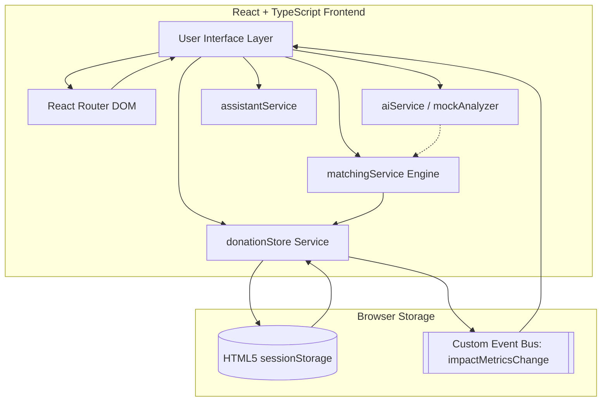
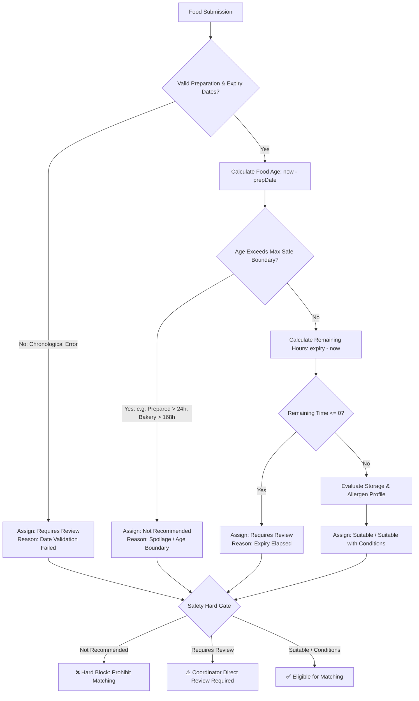
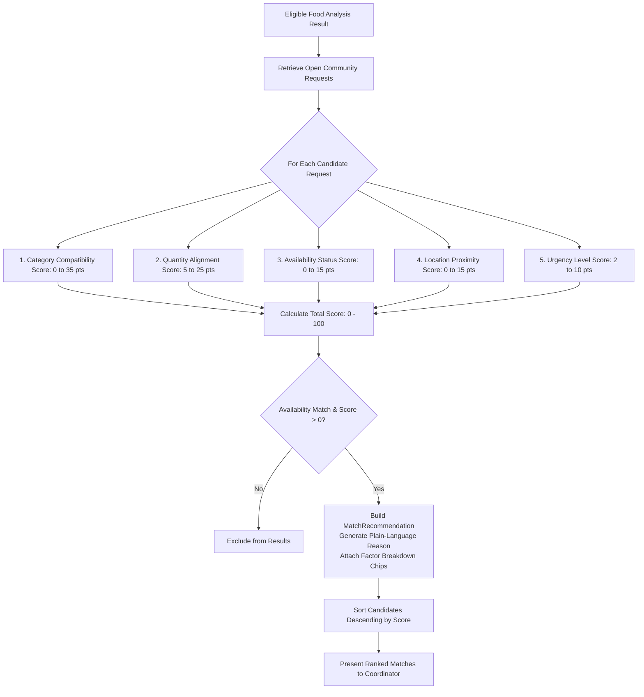
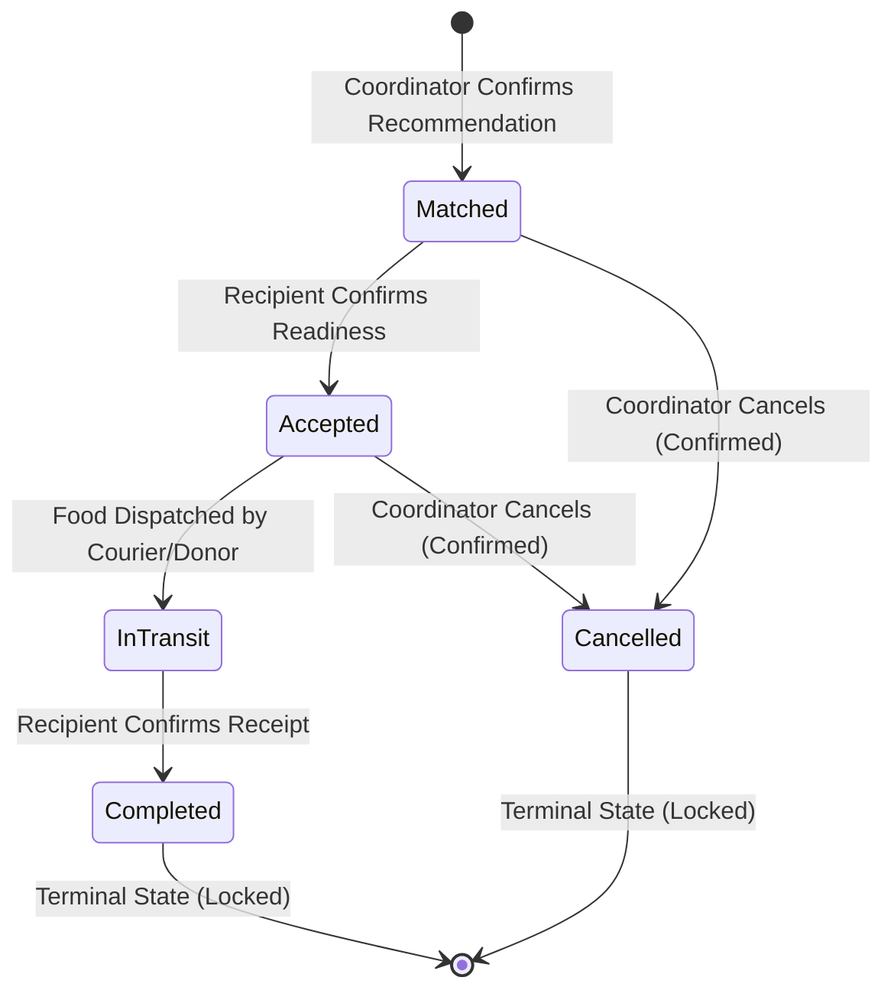
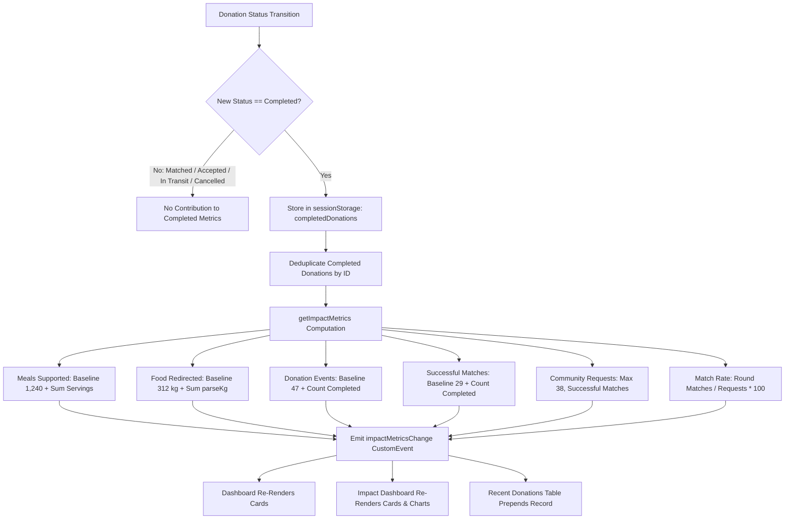
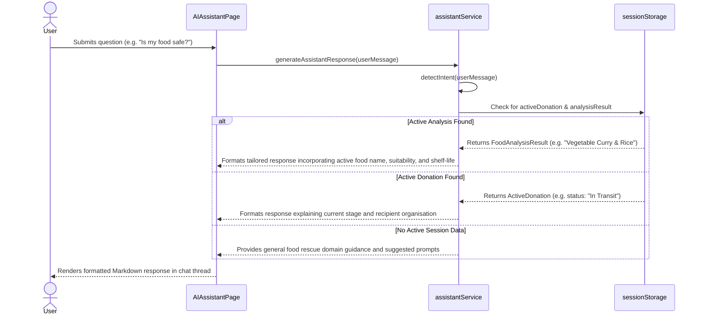
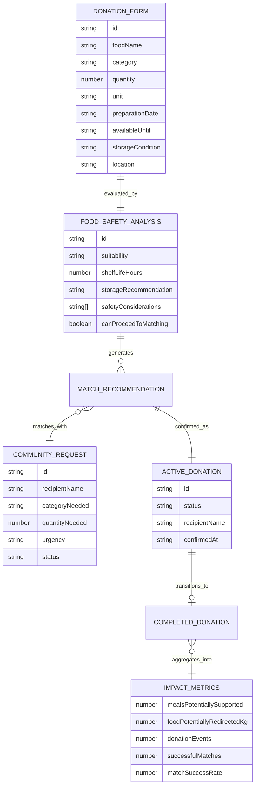
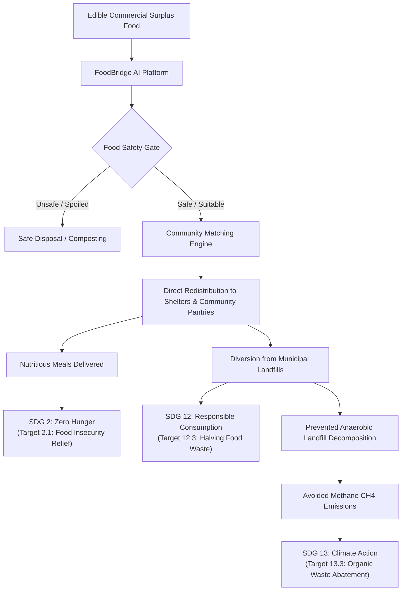

# FoodBridge AI — System Architecture & Flow Diagrams

This document compiles the complete Mermaid diagrams representing the architecture, user flows, safety gates, matching algorithms, lifecycle governance, and intelligence components implemented in FoodBridge AI.

---

## 1. Overall System Architecture



---

## 2. End-to-End User Flow

```mermaid
flowchart LR
    A[1. Landing Dashboard] --> B[2. Donate Food Form]
    B --> C[3. AI Food Safety Analysis]
    C --> D{Safety Gate Check}
    D -->|Blocked: Not Recommended| E[Safety Warning<br/>Transfer Prohibited]
    D -->|Eligible: Suitable| F[4. Community Matching]
    F --> G[5. Select & Review Match]
    G --> H[6. Confirm Match]
    H --> I[7. Donation Status Stepper]
    I --> J[8. Step: Accepted]
    J --> K[9. Step: In Transit]
    K --> L[10. Step: Completed]
    L --> M[11. Dynamic Metrics Updated]
    M --> N[12. Impact Dashboard & Dashboard]
```



---

## 3. Food Safety Analysis & Hard Gate Flow



---

## 4. Multi-Factor Community Matching Flow



---

## 5. Sequential Donation Lifecycle Governance



---

## 6. Dynamic Impact Metrics Accumulation Flow



---

## 7. AI Assistant Context-Aware Interaction Flow



---

## 8. Responsible AI Decision Boundary

```mermaid
flowchart TD
    subgraph Automated Advisory AI [What the System Does]
        A1[Calculate Food Age]
        A2[Derive Shelf-Life Windows]
        A3[Recommend Storage Protocols]
        A4[Score Recipient Compatibility]
        A5[Explain Match Reasons]
        A6[Track State Transitions]
    end

    subgraph Mandatory Human Responsibility [What the Human Does]
        H1[Physical Sensory Inspection: Smell, Texture, Temp]
        H2[Verify Allergen & Ingredient Integrity]
        H3[Direct Verification of Requires Review Flags]
        H4[Final Selection of Community Recipient]
        H5[Authorisation of Physical Handover]
    end

    Automated Advisory AI ==>|Advisory Decision Support| Mandatory Human Responsibility
```

*Explanation: Strict division of responsibility ensuring that automated calculations advise rather than replace human physical inspection, allergen verification, and transfer authority.*

---

## 9. Client-Side Data Entity & State Model



*Explanation: Entity-relationship diagram representing client-side domain data models and state progression from donation submission to impact aggregation.*

---

## 10. Sustainability Impact Pathway (SDG 12, SDG 2 & SDG 13)



*Explanation: The three-pronged environmental and humanitarian impact pathway illustrating how surplus diversion concurrently supports food security (SDG 2), waste reduction (SDG 12), and methane emission avoidance (SDG 13).*

