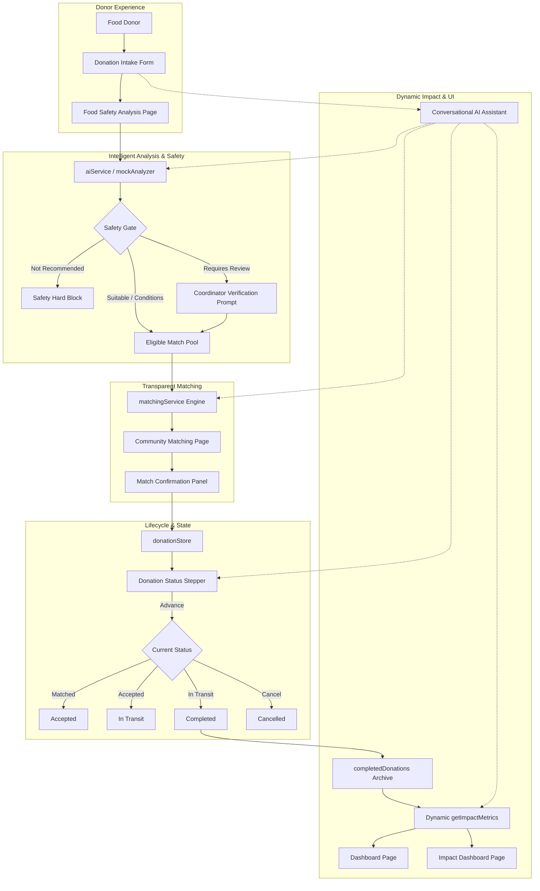
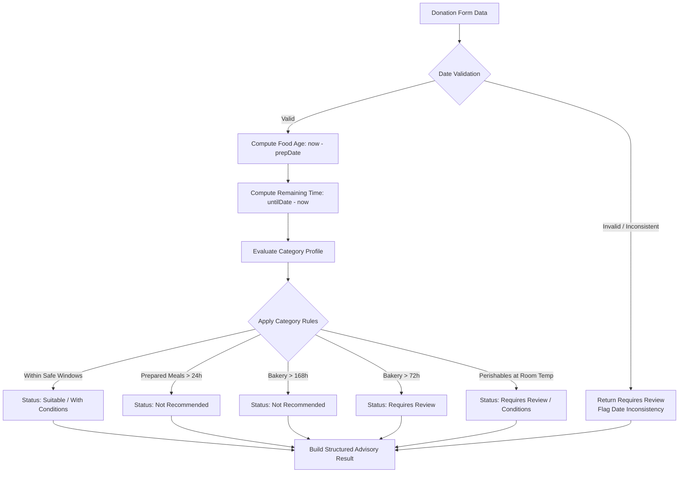
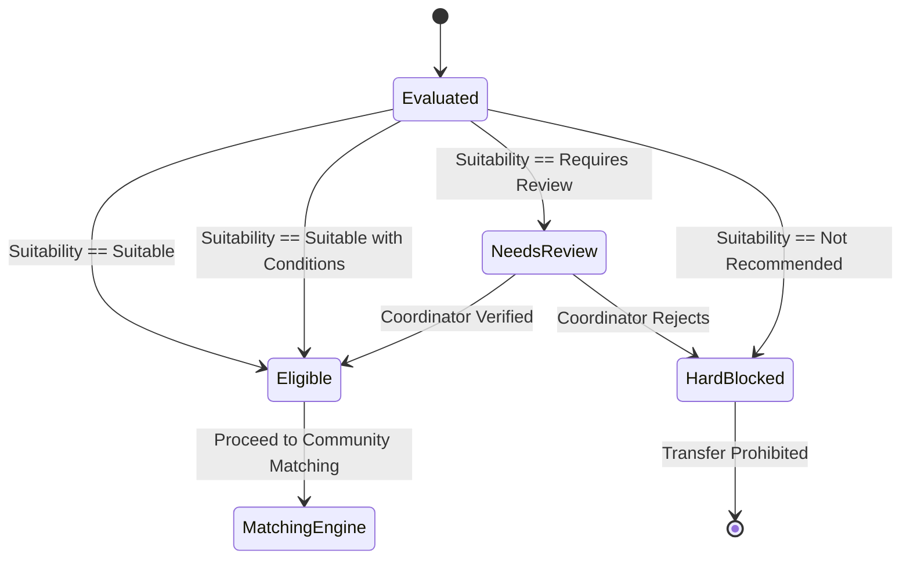
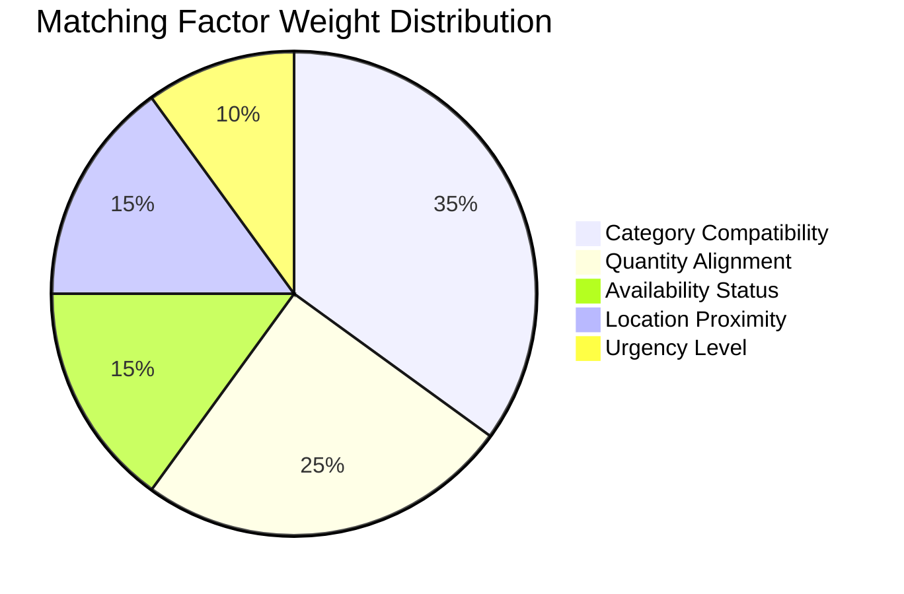
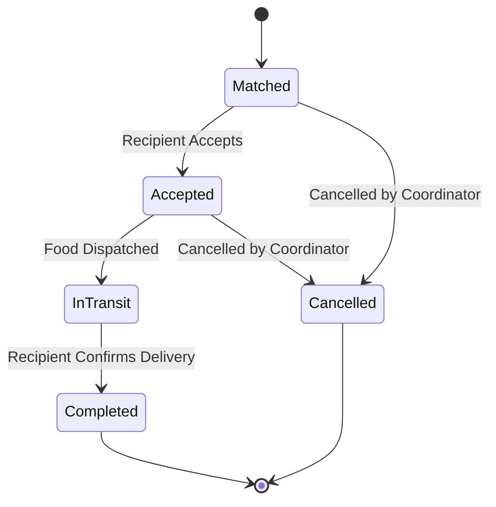
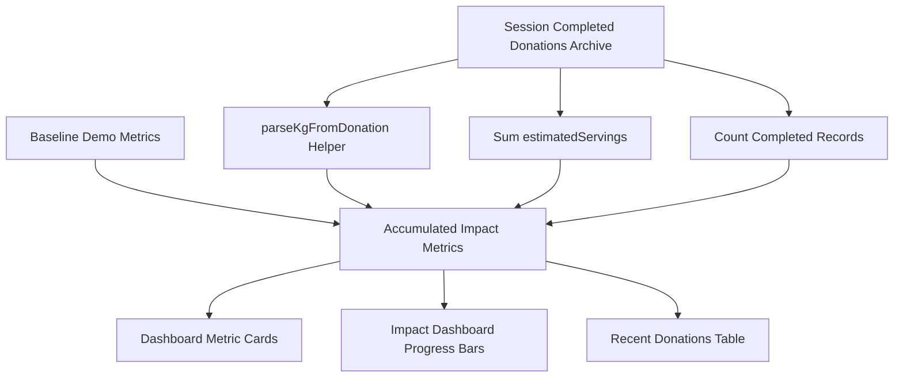
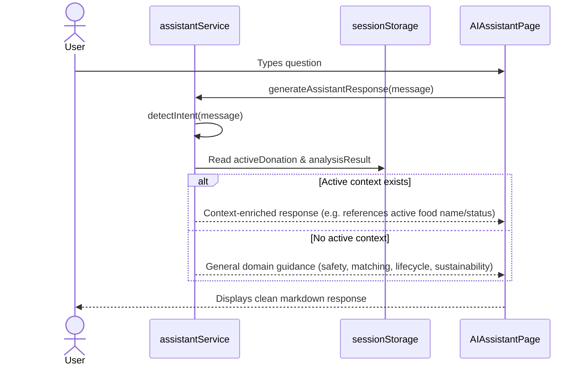

# FoodBridge AI — Comprehensive Final Project Report

**Project Title**: FoodBridge AI  
**Subtitle**: AI-Assisted Food Rescue & Community Redistribution Platform  
**Program Initiative**: 1M1B (1 Million Leaders Insights to Action) — AI for Sustainability  
**Target SDGs**: SDG 3 (Good Health and Well-Being) & SDG 12 (Responsible Consumption and Production)  
**Date**: September 2026  
**Status**: Feature-Complete Demonstration Prototype  

---

## Table of Contents
1. [Executive Summary](#1-executive-summary)
2. [Problem Statement](#2-problem-statement)
3. [Motivation](#3-motivation)
4. [Proposed Solution](#4-proposed-solution)
5. [Objectives](#5-objectives)
6. [SDG Alignment](#6-sdg-alignment)
7. [System Architecture](#7-system-architecture)
8. [User Journey](#8-user-journey)
9. [Food Safety Analysis](#9-food-safety-analysis)
10. [Safety Hard Gate](#10-safety-hard-gate)
11. [Community Matching](#11-community-matching)
12. [Donation Lifecycle](#12-donation-lifecycle)
13. [Dynamic Impact Metrics](#13-dynamic-impact-metrics)
14. [Conversational AI Assistant](#14-conversational-ai-assistant)
15. [Responsible AI & Ethics](#15-responsible-ai--ethics)
16. [Privacy & Data Handling](#16-privacy--data-handling)
17. [Technical Architecture](#17-technical-architecture)
18. [Technology Stack](#18-technology-stack)
19. [Testing & Validation Methodology](#19-testing--validation-methodology)
20. [Test Results](#20-test-results)
21. [Demonstration Results](#21-demonstration-results)
22. [Limitations](#22-limitations)
23. [Future Scope](#23-future-scope)
24. [Conclusion](#24-conclusion)

---

## 1. Executive Summary

FoodBridge AI is a web-based decision-support platform designed to address the dual challenges of food waste and community food insecurity. Commercial kitchens, bakeries, event caterers, and food distributors regularly generate edible surplus food, yet substantial quantities are discarded due to short remaining shelf-life, lack of rapid safety assessment, and coordination friction with local charities.

FoodBridge AI addresses these barriers by introducing an automated, safety-first pipeline that:
1. Performs deterministic, rules-based food safety analysis on surplus submissions.
2. Enforces an architectural safety gate that blocks expired or high-risk items from redistribution.
3. Ranks recipient community organisations using transparent, multi-factor criteria.
4. Manages the handover process through an auditable, sequential donation lifecycle.
5. Dynamically accumulates completed donations into platform impact metrics.
6. Provides an intent-aware, local AI assistant to guide donors and coordinators.

The application operates locally without external API dependencies, API keys, or cloud databases, guaranteeing zero token costs, complete privacy, and 100% deterministic reliability suitable for academic evaluation and demonstration.

---

## 2. Problem Statement

According to the United Nations Environment Programme (UNEP) Food Waste Index Report, roughly one-third of all food produced globally for human consumption is lost or wasted—amounting to approximately 1.3 billion tonnes annually. When organic food decomposes in anaerobic landfill environments, it generates methane, a greenhouse gas significantly more potent than carbon dioxide.

Simultaneously, local community food pantries, relief shelters, and community kitchens frequently face shortages of fresh, nutritious food. Key structural obstacles prevent surplus food from reaching these organisations:
- **Time Pressure**: Perishable and prepared food has a narrow window for safe redistribution.
- **Safety Uncertainties**: Donors fear liability or causing foodborne illness due to unfamiliarity with shelf-life regulations.
- **Logistical Mismatch**: Donors do not know which nearby organisations can accept specific quantities, food types, or temperature requirements.
- **Opaque Processes**: Manual matching without transparent criteria leads to inefficient delivery and uncoordinated efforts.

---

## 3. Motivation

Food redistribution should not rely on guesswork or high-friction manual communication. By leveraging intelligent decision-support software, small-scale commercial donors and community volunteers can be empowered to make safe, fast, and structured redistribution decisions.

The design philosophy of FoodBridge AI is grounded in the principle: **"AI supports, humans decide."** Rather than automating away human responsibility or deploying opaque neural networks that risk hallucinating food safety assessments, FoodBridge AI demonstrates that deterministic, rule-based algorithmic support provides the transparency, consistency, and safety necessary for public health interventions.

---

## 4. Proposed Solution

FoodBridge AI implements a complete end-to-end redistribution workflow:

```
[Surplus Food Intake]
        ↓
[Food Safety Analysis] ──(Age & Shelf Life Rules)
        ↓
{Safety Hard Gate} ──[If Not Recommended] ➔ [BLOCKED & Handover Prohibited]
        ↓ (If Suitable / Conditions / Review)
[Community Matching Engine] ──(6-Factor Evaluation)
        ↓
[Coordinator Confirmation]
        ↓
[Donation Lifecycle Stepper] (Matched → Accepted → In Transit → Completed)
        ↓
[Dynamic Impact Metrics] ──(Persisted in Session)
```

---

## 5. Objectives

1. **Safety Assurance**: Prevent spoiled, stale, or improperly stored food from ever entering community redistribution.
2. **Transparent Matching**: Rank community recipient matches based on objective, explainable criteria rather than unverified scoring.
3. **End-to-End Tracking**: Provide coordinators with clear visibility into the state of confirmed transfers.
4. **Observable Impact**: Dynamically reflect the cumulative outcome of completed food rescue events in real-time metrics.
5. **Zero-Token Local Execution**: Maintain complete privacy, security, and reproducibility without requiring cloud API keys.

---

## 6. SDG Alignment

### Primary: UN SDG 3 — Good Health and Well-Being
* **Target 3.9**: Reduce the number of deaths and illnesses from hazardous chemicals and air, water, and soil pollution and contamination.
* **Mechanism**: Food redistribution must not compromise recipient health. FoodBridge AI enforces rigorous shelf-life boundaries, cold-chain storage checks, and an automated hard safety gate to protect recipients from spoiled food or allergen cross-contamination.

### Secondary: UN SDG 12 — Responsible Consumption and Production
* **Target 12.3**: By 2030, halve per capita global food waste at the retail and consumer levels and reduce food losses along production and supply chains.
* **Mechanism**: By providing donors and coordinators with instant safety assessments and recipient matching, edible commercial food surplus is diverted from landfills to nutritious community meals.

---

## 7. System Architecture



---

## 8. User Journey

1. **Explore Platform**: The user lands on the Dashboard (`/`) to review the platform overview, baseline simulated impact metrics, and core operating principles.
2. **Intake Surplus Food**: On the Donate Food page (`/donate`), the donor submits details: food name, category, quantity, unit, estimated servings, preparation timestamp, availability deadline, storage condition, area, and dietary/allergen notes.
3. **Review AI Safety Analysis**: The user is guided to Food Analysis (`/analysis`). The engine evaluates remaining shelf-life, storage requirements, and assigns an advisory suitability classification with explicit reasoning.
4. **Select Community Match**: If eligible, the donor proceeds to Community Matching (`/matching`). Candidate community requests are displayed with match scores, priority indicators, and factor chips.
5. **Confirm Match**: The user reviews the detailed confirmation panel and confirms the match.
6. **Track Lifecycle**: The coordinator advances the donation on Donation Status (`/donation-status`) from `Matched` &rarr; `Accepted` &rarr; `In Transit` &rarr; `Completed`.
7. **Inspect Dynamic Impact**: The user navigates to the Impact Dashboard (`/impact`) and Dashboard (`/`) to observe real-time increases in meals supported, food redirected, donation events, and matching rate.
8. **Consult AI Assistant**: The user accesses the AI Assistant (`/assistant`) at any point for guidance on food safety, storage recommendations, or donation status.

---

## 9. Food Safety Analysis

The food safety evaluation module (`src/services/mockAnalyzer.ts`) implements deterministic rules reflecting food technology standards:



### Key Safety Rules:
1. **Prepared Meals**: High-risk. Max availability window: 4–8 hours. If preparation exceeds 24 hours or food was left unrefrigerated, it is classified as `Not Recommended`.
2. **Fresh Produce**: 48-hour typical window. Requires cool storage and visual inspection.
3. **Bakery & Bread**: Fresh within 24–72 hours (`Suitable` or `Suitable with Conditions`). Between 72–168 hours: `Requires Review`. Exceeding 168 hours (7 days): `Not Recommended`.
4. **Dairy & Eggs**: Strictly requires refrigerated storage at or below 5 °C. Unrefrigerated dairy triggers immediate warning and review classification.

---

## 10. Safety Hard Gate

The platform establishes an architectural boundary between food safety analysis and recipient matching:



* Unsafe food is blocked at the service level: `matchFromAnalysis()` returns `{ blocked: true, reason: ... }`.
* The UI displays an error notice and completely disables match selection and confirmation buttons.

---

## 11. Community Matching

Matching is performed across six weighted criteria totaling 100 points:



1. **Category Compatibility (35 pts)**: Verifies that the recipient organisation's accepted food types include the donated category.
2. **Quantity Alignment (25 pts)**: Assesses available servings against requested quantities (Full need met: 25 pts; Partial need >= 50%: 15 pts; Insufficient < 50%: 5 pts).
3. **Availability Status (15 pts)**: Candidate must be `Open` (15 pts) or `Partially Matched` (10 pts). `Closed` requests are excluded.
4. **Location Proximity (15 pts)**: Same-district donations receive 15 pts; neighboring districts receive 8 pts.
5. **Urgency Level (10 pts)**: `Critical` urgency receives 10 pts; `High` receives 7 pts; `Medium` receives 4 pts; `Low` receives 2 pts.

---

## 12. Donation Lifecycle



* **Linear Progress**: State advances exclusively forward (`Matched` &rarr; `Accepted` &rarr; `In Transit` &rarr; `Completed`).
* **Terminal Stability**: Reaching `Completed` or `Cancelled` locks the donation state.
* **Cancellation Safety**: Cancellation requires two-step confirmation and is blocked once food is `In Transit`.

---

## 13. Dynamic Impact Metrics



### Metric Calculations
- **Meals Potentially Supported**: `Baseline (1,240) + Sum(completedDonations.estimatedServings)`
- **Food Potentially Redirected**: `Baseline (312 kg) + Sum(parseKgFromDonation(quantity, servings))`
- **Donation Events**: `Baseline (47) + Count(completedDonations)`
- **Successful Matches**: `Baseline (29) + Count(completedDonations)`
- **Community Requests**: `Math.max(38, successfulMatches)`
- **Match Success Rate**: `Math.round((successfulMatches / communityRequests) * 100)`

---

## 14. Conversational AI Assistant



---

## 15. Responsible AI & Ethics

1. **Human Oversight**: AI outputs are advisory. A human coordinator must confirm matches and verify physical food safety.
2. **Explainability**: Every match and safety score provides plain-language reasons and component breakdowns.
3. **No False Certainty**: Prohibits claims of absolute safety (`100% safe` or `guaranteed safe`).
4. **Local Execution**: Eliminates cloud API vulnerabilities, external tracking, and stochastic hallucinations.

---

## 16. Privacy & Data Handling

- **No Personal Identifiable Information (PII)**: The intake form requires no donor names, phone numbers, email addresses, or precise street addresses.
- **Client-Side Session Storage**: Data exists solely within the user's browser `sessionStorage`. No data is uploaded to remote servers or third-party trackers.
- **Immediate Ephemerality**: Closing the browser session completely purges all entered data.

---

## 17. Technical Architecture

- **SPA Routing**: Client-side navigation powered by React Router v6.
- **Decoupled Stores**: `donationStore.ts` acts as a reactive single source of truth using `CustomEvent` dispatches for same-tab reactivity and `storage` event listeners for cross-tab sync.
- **Strict Typing**: Comprehensive TypeScript interfaces across domain models (`FoodDonation`, `FoodAnalysisResult`, `MatchRecommendation`, `ActiveDonation`, `ImpactMetrics`).

---

## 18. Technology Stack

- **Framework**: React 18.2.0
- **Language**: TypeScript 5.2.2
- **Build Tool**: Vite 5.0.8
- **Routing**: React Router DOM 6.22.0
- **Styling**: CSS Modules with CSS Custom Properties
- **State/Persistence**: HTML5 `sessionStorage`
- **Linting & Code Quality**: ESLint 8.55.0

---

## 19. Testing & Validation Methodology

Testing was performed across five distinct verification tiers:
1. **Compilation & Typechecking**: `tsc --noEmit` and `vite build`.
2. **Food Safety & Matching Test Suite**: Automated execution of rule evaluations, boundary conditions, and gate blocking.
3. **Lifecycle & Metrics Test Suite**: Verification of state transitions, kg conversions, idempotency, and multi-donation accumulation.
4. **AI Assistant Intent Suite**: 30 natural-language queries testing intent detection and session context injection.
5. **Headless Browser E2E Suite**: End-to-end user flows driven via Chrome DevTools Protocol (CDP) on headless Edge.

---

## 20. Test Results

### Automated Test Suite Matrix

| Test Suite | File | Tests Executed | Passed | Failed | Status |
| :--- | :--- | :--- | :--- | :--- | :--- |
| **Core Safety & Matching** | `scratch/test_suite.ts` | 12 | 12 | 0 | **PASS** |
| **Lifecycle & Metrics** | `scratch/test_metrics.ts` | 10 | 10 | 0 | **PASS** |
| **Conversational Assistant** | `scratch/test_assistant.ts` | 30 | 30 | 0 | **PASS** |
| **Browser E2E Lifecycle** | `scratch/test_browser_metrics_cdp.ts` | 13 | 13 | 0 | **PASS** |
| **Production Build** | `npm run build` | 64 modules | 64 | 0 | **PASS** |

---

## 21. Demonstration Results

The end-to-end browser verification verified the exact metric progression:

| State / Stage | Meals Supported | Food Redirected (kg) | Donation Events | Successful Matches | Match Rate |
| :--- | :--- | :--- | :--- | :--- | :--- |
| **Baseline (Empty Session)** | 1,240 | 312 | 47 | 29 | 76% (29/38) |
| **Donation 1: Matched** | 1,240 | 312 | 47 | 29 | 76% (29/38) |
| **Donation 1: In Transit** | 1,240 | 312 | 47 | 29 | 76% (29/38) |
| **Donation 1: Completed** (25 servings / 10 kg) | **1,265** (+25) | **322** (+10) | **48** (+1) | **30** (+1) | **79%** (30/38) |
| **Page Reload (Persistence)** | 1,265 | 322 | 48 | 30 | 79% (30/38) |
| **Donation 2: Completed** (30 servings / 12 kg) | **1,295** (+55) | **334** (+22) | **49** (+2) | **31** (+2) | **82%** (31/38) |

---

## 22. Limitations

1. **Simulation Scope**: All community recipients, match recommendations, and baseline impact numbers are simulated demonstration data.
2. **Session Persistence**: Data is preserved within `sessionStorage`. Closing the browser tab or launching a private browsing session resets the platform to baseline demo figures.
3. **Deterministic Rules**: Analysis and matching rely on local rule heuristics rather than live external machine learning models.
4. **No Real Logistics**: Transport arrangements are represented via the interactive stepper; no live driver dispatch or GPS telematics are integrated.

---

## 23. Future Scope

1. **Real-Time Organization Sync**: Integration with verified food rescue API directories to pull live community requirements.
2. **Multi-User Real-Time Sync**: WebSockets or server-backed state management for multi-coordinator collaboration.
3. **Offline Progressive Web App (PWA)**: Service workers to allow food rescue recording in areas with intermittent connectivity.
4. **Multimodal Food Inspection**: On-device computer vision models to evaluate visual freshness (e.g. produce bruising or packaging damage).

---

## 24. Conclusion

FoodBridge AI demonstrates a robust, production-polished blueprint for technology-enabled surplus food redistribution. By combining deterministic safety checks, algorithmic transparency, sequential lifecycle governance, and responsive local intelligence, the project showcases how responsible AI can drive meaningful progress toward **UN SDG 3** and **UN SDG 12** while keeping human coordinators firmly in control.
