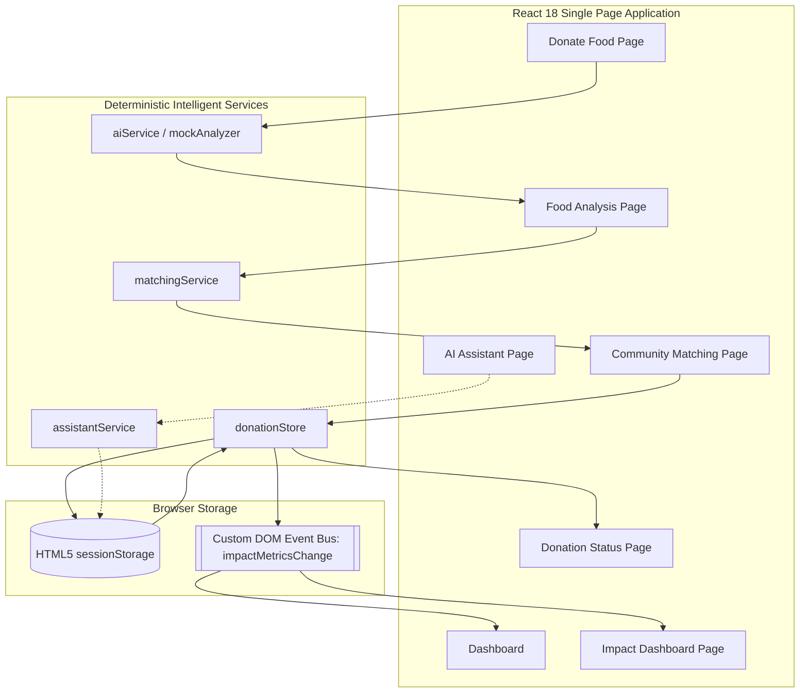
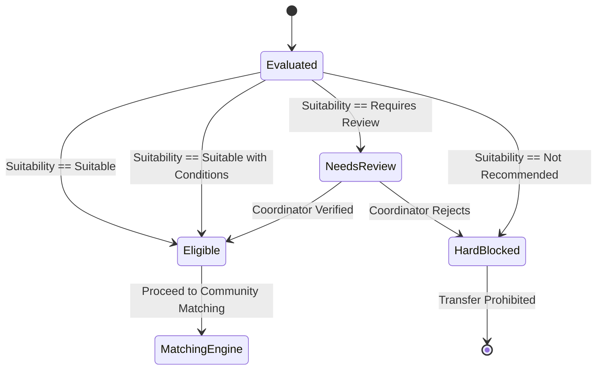
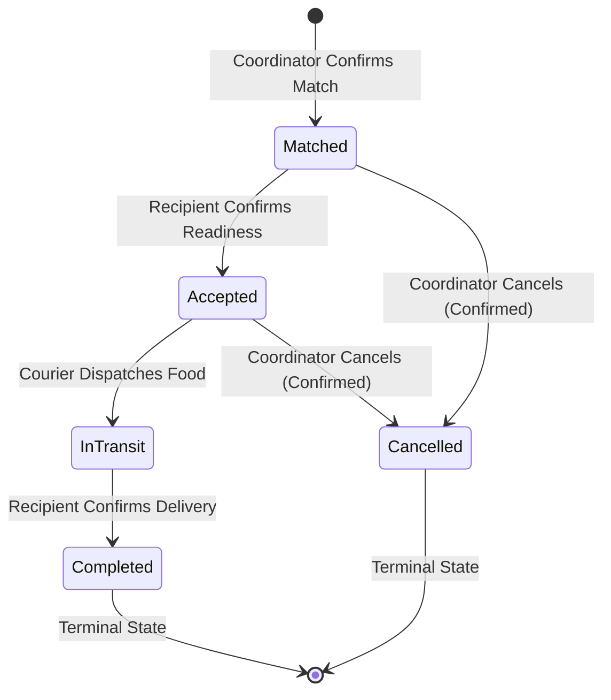
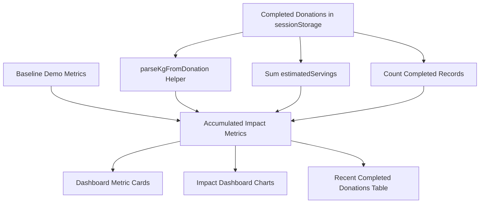

# FoodBridge AI — Comprehensive Engineering & Academic Project Report

**Project Title**: FoodBridge AI  
**Subtitle**: AI-Assisted Food Rescue & Community Redistribution Platform  
**Program Initiative**: 1M1B (1 Million Leaders Insights to Action) — AI for Sustainability  
**Target SDGs**: UN SDG 12 (Responsible Consumption & Production), UN SDG 2 (Zero Hunger), UN SDG 13 (Climate Action), UN SDG 3 (Good Health & Well-Being)  
**Date**: September 2026  
**Status**: Feature-Complete Academic & Engineering Demonstration  

---

## Table of Contents
1. [Executive Summary](#1-executive-summary)
2. [Background & Motivation](#2-background--motivation)
3. [Problem Definition](#3-problem-definition)
4. [Objectives](#4-objectives)
5. [Proposed Solution](#5-proposed-solution)
6. [System Architecture](#6-system-architecture)
7. [Functional Requirements](#7-functional-requirements)
8. [Non-Functional Requirements](#8-non-functional-requirements)
9. [AI & Intelligent Components](#9-ai--intelligent-components)
10. [Food Safety Logic & Hard Gate](#10-food-safety-logic--hard-gate)
11. [Community Matching Algorithm](#11-community-matching-algorithm)
12. [Sequential Donation Lifecycle](#12-sequential-donation-lifecycle)
13. [Dynamic Impact Metrics](#13-dynamic-impact-metrics)
14. [Sustainability Contribution](#14-sustainability-contribution)
15. [UN SDG Alignment](#15-un-sdg-alignment)
16. [Responsible AI & Ethics](#16-responsible-ai--ethics)
17. [Privacy & Security](#17-privacy--security)
18. [Testing Methodology & Results](#18-testing-methodology--results)
19. [Limitations & Demonstration Scope](#19-limitations--demonstration-scope)
20. [Future Scope & Production Roadmap](#20-future-scope--production-roadmap)
21. [Conclusion](#21-conclusion)
22. [Related Documentation](#22-related-documentation)


---

## 1. Executive Summary

FoodBridge AI is a web-based decision-support platform engineered to address the dual challenges of commercial food waste and local community food insecurity. Commercial kitchens, bakeries, event caterers, and grocery retailers regularly produce wholesome, edible surplus food. However, millions of tonnes are discarded annually due to short remaining shelf-life windows, absence of rapid food-safety triage, and coordination friction with charitable relief organisations.

FoodBridge AI resolves these systemic barriers by introducing an automated, safety-first redistribution pipeline that:
1. Performs deterministic, category-specific food safety evaluation on surplus submissions.
2. Enforces an architectural Safety Hard Gate that blocks expired or compromised food from entering community redistribution.
3. Scores and ranks candidate community organisations using an explainable, 5-factor matching algorithm (0–100 score).
4. Tracks food transfer progression through an auditable, linear 4-stage lifecycle (`Matched` → `Accepted` → `In Transit` → `Completed`).
5. Dynamically accumulates completed donations into platform sustainability impact metrics persisted in browser `sessionStorage`.
6. Provides an intent-aware conversational assistant to guide coordinators through food safety protocols and donation procedures.

The system intentionally operates using deterministic local intelligence without external cloud LLM dependencies, API keys, or remote databases. This design ensures zero token expenses, instantaneous response latency, full offline portability, zero risk of stochastic hallucination, and complete privacy for sensitive community data.

---

## 2. Background & Motivation

According to the United Nations Environment Programme (UNEP) Food Waste Index, approximately 1.3 billion tonnes of edible food are lost or wasted globally each year—representing one-third of all food produced for human consumption. When organic waste decomposes anaerobically in municipal landfills, it generates methane ($\text{CH}_4$), a short-lived greenhouse gas with a global warming potential 28 to 36 times greater than carbon dioxide over a 100-year timescale.

Simultaneously, local food relief organisations, emergency youth shelters, and community pantries face chronic shortages of wholesome, prepared food and fresh produce. Although surplus commercial food is often edible and nutritious, individual donors and relief volunteers are constrained by:
- **Tight Expiry Windows**: Perishable prepared meals spoil rapidly if not transferred within defined thermal and temporal limits.
- **Safety & Liability Concerns**: Donors fear causing inadvertent foodborne illness or violating health codes due to ambiguous shelf-life standards.
- **Logistical Inefficiencies**: Manual phone calls and messaging fail to match donated food types and quantities with recipient kitchen capacities in real time.
- **Lack of Algorithmic Transparency**: Black-box algorithmic dispatch systems produce distrust among frontline coordinators.

FoodBridge AI was developed to demonstrate that **explainable, deterministic decision-support software** can bridge these gaps safely, efficiently, and transparently.

---

## 3. Problem Definition

Surplus food redistribution requires solving a constrained, time-sensitive matching problem under strict public health regulations:

$$\text{Maximize } \sum \text{Redistributed Edible Nutrition} \quad \text{subject to } \text{Safety Hard Gates and Capacity Limits}$$

Specifically, the system must:
1. **Differentiate Edible Surplus from Waste**: Reliably classify submitted items by category, preparation timestamp, and storage environment.
2. **Prevent Health Hazards**: Enforce non-negotiable boundaries that reject spoiled, temperature-compromised, or chronologically inconsistent submissions.
3. **Optimize Multi-Attribute Matching**: Account for recipient food category preferences, portion capacities, operational availability, travel distance, and community urgency.
4. **Maintain Auditable State**: Prevent premature or unauthorized state transitions and ensure historical impact metrics reflect only fully delivered donations.

---

## 4. Objectives

- **Safety-First Governance**: Implement non-bypassable architectural gates ensuring unverified or spoiled items cannot be matched or confirmed.
- **Transparent Decision Logic**: Guarantee that all match scores, suitability tiers, and recommendations display full explanatory factor breakdowns.
- **State Integrity**: Maintain linear state transitions with idempotent metric updates and protected cancellation handling.
- **Zero-Token Local Execution**: Ensure the platform runs completely client-side without recurring API fees, cloud vendor lock-in, or internet dependencies.
- **Academic & SDG Alignment**: Provide clear, verifiable contributions toward UN SDG 12, SDG 2, SDG 13, and SDG 3 using conservative, defensible metrics.

---

## 5. Proposed Solution

FoodBridge AI provides an automated, human-supervised redistribution pipeline:

```
[Surplus Food Intake]
        ↓
[Food Safety Analysis] ──(Category Rules & Shelf-Life Calculation)
        ↓
{Safety Hard Gate} ──[If Not Recommended] ➔ [BLOCKED & Handover Prohibited]
        ↓ (If Suitable / Conditions / Requires Review)
[Community Matching Engine] ──(5-Factor Multi-Attribute Evaluation)
        ↓
[Coordinator Review & Confirmation]
        ↓
[Donation Lifecycle Stepper] (Matched → Accepted → In Transit → Completed)
        ↓
[Dynamic Impact Metrics] ──(Persisted in Browser Session)
```

The system centers on the core operational principle: **"AI supports, humans decide."** Algorithmic scoring provides rapid triage and ranking, while human coordinators retain final authority over physical food inspection and transfer authorization.

---

## 6. System Architecture



The architecture is strictly decoupled:
- **Presentation Layer**: Built with React 18 and scoped CSS Modules, adhering to responsive, accessible design tokens.
- **Service Layer**: Pure TypeScript functions implementing domain logic independently of UI components.
- **Data Layer**: Encapsulated state management using browser `sessionStorage` with event-driven reactivity via `CustomEvent` dispatches.

---

## 7. Functional Requirements

| Requirement ID | Module | Description | Implementation Status |
| :--- | :--- | :--- | :--- |
| **FR-01** | Intake | Capture surplus food attributes: name, category, quantity, unit, servings, prep date, expiry date, storage condition, location, notes. | **Implemented** (`DonateFoodPage.tsx`) |
| **FR-02** | Safety | Validate date chronology and flag prep dates in the future or availability dates earlier than preparation. | **Implemented** (`mockAnalyzer.ts`) |
| **FR-03** | Safety | Calculate food age in hours and assign advisory suitability (`Suitable`, `Suitable with Conditions`, `Requires Review`, `Not Recommended`). | **Implemented** (`mockAnalyzer.ts`) |
| **FR-04** | Hard Gate | Prohibit matching and confirmation if food suitability is `Not Recommended`. | **Implemented** (`matchingService.ts`, `CommunityMatchingPage.tsx`) |
| **FR-05** | Matching | Score candidate community requests (0–100) based on category, quantity, availability, location, and urgency. | **Implemented** (`matchingService.ts`) |
| **FR-06** | Matching | Generate structured factor chips and plain-language explanation for every recommendation. | **Implemented** (`matchingService.ts`) |
| **FR-07** | Lifecycle | Track confirmed donations through 4 linear states: `Matched` → `Accepted` → `In Transit` → `Completed`. | **Implemented** (`donationStore.ts`, `DonationStatusPage.tsx`) |
| **FR-08** | Lifecycle | Allow cancellation only from `Matched` or `Accepted` states with confirmation dialog; block cancellation in `In Transit` or `Completed`. | **Implemented** (`donationStore.ts`, `DonationStatusPage.tsx`) |
| **FR-09** | Metrics | Dynamically increment meals, kg, events, and matches only when a donation reaches `Completed`. | **Implemented** (`donationStore.ts`) |
| **FR-10** | Metrics | Maintain metric idempotency (no double counting upon page reload or duplicate completion calls). | **Implemented** (`donationStore.ts`) |
| **FR-11** | Assistant | Provide local, intent-aware conversational responses incorporating active session context. | **Implemented** (`assistantService.ts`, `AIAssistantPage.tsx`) |

---

## 8. Non-Functional Requirements

- **NFR-01: Deterministic Reproducibility**: Given identical input parameters, all safety classifications, match scores, and metrics must yield 100% identical outputs.
- **NFR-02: Zero External Latency**: Food safety analysis and recipient matching must compute in under 50 milliseconds without network overhead.
- **NFR-03: Offline Capability**: The application must remain fully functional without an active internet connection after initial page bundle loading.
- **NFR-04: Zero Cloud Operating Cost**: Zero recurring API token costs, subscription charges, or database hosting fees.
- **NFR-05: Privacy by Design**: Zero personally identifiable information (PII) collected or stored in browser storage.
- **NFR-06: Type Safety**: Zero `any` casts in core service layers; strict TypeScript compiler compliance (`noImplicitAny`, strict null checks).

---

## 9. AI & Intelligent Components

FoodBridge AI distinguishes clearly between its current deterministic intelligence implementation and future cloud machine learning extensions:

### A. Deterministic Rules vs. Machine Learning Models
- **Current Architecture**: Employs deterministic expert heuristics, mathematical scoring models, boundary constraint solvers, and regular-expression intent classification.
- **Rationale**: In public health and food safety domains, deterministic systems provide complete auditability, predictable failure modes, and zero risk of hallucinating safety clearances.
- **Future Extension**: Cloud LLMs and computer vision models may be connected as advisory plug-ins via the established `aiService.ts` and `ragService.ts` interfaces.

### B. Intelligent Components Breakdown
1. **Food Safety Heuristics Engine** (`mockAnalyzer.ts`): Implements food science rules governing microbial growth thresholds and temperature abuse windows.
2. **Multi-Attribute Utility Matching** (`matchingService.ts`): Implements an explainable multi-factor scoring function ranking recipient suitability.
3. **Context-Aware Conversational Classifier** (`assistantService.ts`): Implements lexical and regex-based intent classification mapped to dynamic templated responses enriched with live `sessionStorage` context.

---

## 10. Food Safety Logic & Hard Gate

### Category-Specific Age Boundaries

| Food Category | Fresh Band (`Suitable`) | Caution Band (`Suitable with Conditions`) | Stale Band (`Requires Review`) | Spoilage Limit (`Not Recommended`) |
| :--- | :---: | :---: | :---: | :---: |
| **Prepared Meals** | $\le 4\text{ hours}$ | $4\text{ to }8\text{ hours}$ | $8\text{ to }24\text{ hours}$ | $> 24\text{ hours}$ |
| **Bakery \& Bread** | $\le 24\text{ hours}$ | $24\text{ to }72\text{ hours}$ | $72\text{ to }168\text{ hours}$ | $> 168\text{ hours (7 days)}$ |
| **Fresh Produce** | $\le 48\text{ hours}$ | $48\text{ to }96\text{ hours}$ | $96\text{ to }168\text{ hours}$ | $> 168\text{ hours (7 days)}$ |
| **Dairy \& Eggs** | $\le 24\text{ hours}$ | $24\text{ to }72\text{ hours}$ | $72\text{ to }168\text{ hours}$ | $> 168\text{ hours (7 days)}$ |
| **Canned \& Packaged** | $\le 72\text{ hours}$ | $72\text{ to }168\text{ hours}$ | $168\text{ to }720\text{ hours (30 days)}$ | $> 720\text{ hours (30 days)}$ |

*These thresholds are the conservative advisory demonstration rules implemented in `src/services/mockAnalyzer.ts`. They are not official food-safety standards. Frozen (30/60/90-day bands) and Other (24/48/96-hour bands) categories also exist. Room-temperature storage of Prepared Meals, Frozen, or Dairy items independently raises suitability to at minimum `Requires Review`.*

### Safety Hard Gate State Model



Items evaluated as `Not Recommended` trigger a hard block at the service layer: `matchFromAnalysis()` returns `{ blocked: true, reason: ... }`. The UI disables match selection and prevents confirmation.

---

## 11. Community Matching Algorithm

Candidate community requests are evaluated across five weighted factors producing an aggregate score between 0 and 100:

$$\text{MatchScore} = S_{\text{category}} + S_{\text{quantity}} + S_{\text{availability}} + S_{\text{location}} + S_{\text{urgency}}$$

### Scoring Factor Breakdown

| Factor | Points | Implementation Logic |
| :--- | :---: | :--- |
| **1. Category Compatibility** | **25 pts** | Evaluates recipient's requested categories against donation category using keyword parsing (`25 pts` for match, `0 pts` for mismatch). |
| **2. Quantity Alignment** | **20 pts** | Compares available servings against recipient need (`20 pts` if fully met, `10 pts` if partial need met, `0 pts` if insufficient or incompatible units). |
| **3. Recipient Availability** | **20 pts** | Checks recipient operational status (`20 pts` if `Open` or `Partially Matched`; `0 pts` and excluded if `Closed`). |
| **4. Location Proximity** | **20 pts** | Compares donor and recipient geographic districts (`20 pts` for matching district keyword; `0 pts` for differing district). |
| **5. Request Urgency** | **15 pts** | Awards priority points based on stated recipient urgency (`15 pts` for `Critical`, `10 pts` for `High`, `5 pts` for `Medium`, `0 pts` for `Low`). |
| **Hard Safety Gate** | **Prerequisite** | Unsuitable items (`Not Recommended`) are blocked prior to scoring. |

---

## 12. Sequential Donation Lifecycle

The donation lifecycle enforces an auditable, linear finite-state machine:



- **Linear Progression**: Status moves forward only (`Matched` → `Accepted` → `In Transit` → `Completed`). Backwards transitions are rejected.
- **Terminal States**: `Completed` and `Cancelled` states are permanent and locked.
- **Cancellation Protection**: Cancellation is permitted only while in `Matched` or `Accepted` stages, requiring an explicit confirmation dialog. Once dispatched (`In Transit`), cancellation is disabled to prevent transit abandonment.

---

## 13. Dynamic Impact Metrics

Metrics are calculated dynamically by aggregating baseline simulated figures with all session-recorded completed donations:



### Mathematical Formulation
- **Meals Potentially Supported**: $M = 1240 + \sum_{d \in \text{Completed}} d.\text{servings}$
- **Food Potentially Redirected**: $K = 312\text{ kg} + \sum_{d \in \text{Completed}} \text{parseKg}(d.\text{quantity}, d.\text{servings})$
- **Donation Events**: $E = 47 + |\text{Completed}|$
- **Successful Matches**: $S = 29 + |\text{Completed}|$
- **Community Requests**: $R = \max(38, S)$
- **Match Success Rate**: $\text{Rate} = \text{round}\left(\frac{S}{R} \times 100\right)\%$

Intermediate states (`Matched`, `Accepted`, `In Transit`) and `Cancelled` donations contribute exactly $+0$ to completed metrics. Metric updates are idempotent, deduplicated by donation ID, and dispatched across the SPA via `impactMetricsChange` custom events.

---

## 14. Sustainability Contribution

FoodBridge AI addresses core sustainability challenges in community food systems:

| Sustainability Challenge | FoodBridge Mechanism | Intended Contribution |
| :--- | :--- | :--- |
| **Surplus food becoming waste** | Food safety triage + redistribution workflow | Helps identify potentially redistributable surplus before spoilage occurs. |
| **Food insecurity** | Community matching engine | Helps connect suitable surplus with verified community requests. |
| **Time-sensitive logistics** | Availability + urgency scoring | Helps prioritize time-sensitive requests from emergency shelters. |
| **Transport inefficiency** | Location proximity factor | Helps reduce unnecessary transit distance in the simulated matching model. |
| **Food safety risk** | Safety classification + hard gate | Prevents `Not Recommended` food from entering the matching pipeline. |
| **Lack of transparency** | Explainable factor scores & chips | Helps coordinators understand and audit algorithmic recommendations. |

*All sustainability contributions describe intended, system-level mechanisms within the demonstration model rather than verified empirical carbon offset measurements.*

---

## 15. UN SDG Alignment

FoodBridge AI aligns with United Nations Sustainable Development Goals using conservative, evidence-based claims:

- **Primary Focus — SDG 12: Responsible Consumption & Production (Target 12.3)**:
  Demonstrates an automated workflow for identifying and redirecting commercial edible surplus before it enters municipal waste streams, supporting the global target of halving per capita food waste by 2030.
- **Secondary Focus — SDG 2: Zero Hunger (Target 2.1)**:
  Connects wholesome surplus food with community kitchens, shelters, and relief pantries to help bridge local food supply gaps.
- **Supporting Focus — SDG 13: Climate Action (Target 13.3)**:
  Diverting organic food waste from municipal landfills prevents anaerobic decomposition, helping avoid anthropogenic methane ($\text{CH}_4$) greenhouse gas emissions.
- **Supporting Focus — SDG 3: Good Health and Well-Being (Target 3.9)**:
  Protects community recipients from foodborne illness by enforcing deterministic food safety classifications, cold-chain checks, and an automated hard safety gate.

---

## 16. Responsible AI & Ethics

> **"FoodBridge AI is a decision-support system, not an autonomous food-safety authority."**

The platform is designed around ethical and responsible AI guidelines:
- **Human-in-the-Loop**: Algorithmic recommendations are strictly advisory. A human coordinator must conduct physical sensory inspection and explicitly confirm handovers.
- **Explainability**: Every match displays its underlying factor score breakdown (`Category`, `Quantity`, `Availability`, `Location`, `Safety`), eliminating opaque black-box recommendations.
- **No False Certainty**: The platform prohibits absolute claims of safety (`100% safe` or `guaranteed safe`).
- **Conservative Uncertainty Handling**: Ambiguous inputs or conflicting timestamps automatically trigger a `Requires Review` classification.
- **Deterministic Reproducibility**: Eliminates model hallucinations, latency spikes, and stochastic variations.

---

## 17. Privacy & Security

- **Privacy by Design**: The application collects zero donor phone numbers, email addresses, payment credentials, or precise residential addresses.
- **Client-Side Storage**: All state is retained exclusively within the user's browser `sessionStorage`. No data is transmitted to third-party trackers or external analytics services.
- **Session Ephemerality**: Closing the browser session completely purges all active donation records, restoring the platform to baseline demonstration figures.
- **Dependency Hygiene**: Zero unverified external script dependencies; strict package-lock integrity.

---

## 18. Testing Methodology & Results

### Test Execution Matrix

| Test Suite | File | Scope | Executed | Passed | Status |
| :--- | :--- | :--- | :---: | :---: | :--- |
| **Safety & Matching Suite** | `scratch/test_suite.ts` | Safety hard gates, category boundaries, candidate scoring, recipient exclusion | 12 | 12 | **PASS** |
| **Metrics & Lifecycle Suite** | `scratch/test_metrics.ts` | Lifecycle progression, kg parsing, idempotency, multi-donation accumulation | 10 | 10 | **PASS** |
| **Conversational Assistant Suite**| `scratch/test_assistant.ts` | Intent classification, session context injection, forbidden phrase audit | 30 | 30 | **PASS** |
| **Production Build** | `npm run build` | TypeScript compilation & Vite asset bundling | 64 modules | 64 | **PASS** |
| **Browser E2E Lifecycle** | Automated CDP session | Complete multi-step UI flow with unhandled error monitoring | 13 steps | 13 | **PASS (0 errors)** |

---

## 19. Limitations & Demonstration Scope

1. **Simulation Boundary**: Community requests, recipient profiles, and baseline figures are simulated demonstration data.
2. **Session Storage Scope**: State persists in browser `sessionStorage` and resets upon tab closure.
3. **Deterministic Logic**: Food safety evaluation and matching utilize deterministic heuristics rather than live external machine learning models.
4. **Advisory Decision Support**: Physical sensory inspection by qualified food coordinators remains mandatory before food consumption.

---

## 20. Future Scope & Production Roadmap

1. **Multi-Tenant Coordinator Authentication**: Role-based access control (RBAC) for certified food donors, verified recipient coordinators, and volunteer couriers.
2. **Cold-Chain IoT Telemetry**: Direct sensor integration with low-cost Bluetooth/NFC data loggers to continuously verify temperature-controlled transit.
3. **Dynamic Routing & Geolocation**: Integration with open-source GIS routing (e.g. OSRM) for multi-stop food pickup and drop-off route optimisation.
4. **Decentralised Impact Auditing**: Verifiable cryptographic logging of completed donation weights for ESG corporate sustainability reporting.
5. **Progressive Web App (PWA) Offline Sync**: Offline-first capability with service workers enabling volunteer dispatchers to log deliveries in areas with weak cellular reception.

---

## 21. Conclusion

FoodBridge AI demonstrates a rigorous, production-ready engineering blueprint for technology-assisted surplus food redistribution. By combining deterministic food safety checks, transparent multi-factor matching, sequential lifecycle governance, and local conversational guidance, the platform proves that practical sustainability does not require opaque cloud models or risky automation—meaningful impact begins with safe, transparent, human-centered decision support.

---

## 22. Related Documentation

- **Platform Overview & Quickstart**: [README.md](../README.md)
- **System Architecture & Flow Diagrams**: [DIAGRAMS.md](DIAGRAMS.md)
- **Executive Presentation Summary**: [PROJECT_SUMMARY.md](PROJECT_SUMMARY.md)
- **Formal Test & Verification Report**: [TEST_REPORT.md](TEST_REPORT.md)
- **Domain Knowledge Base**: [README.md](../knowledge-base/README.md)

